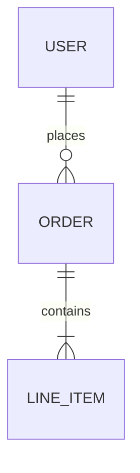

# Learning

Personal tech notes and learnings built with [Hugo](https://gohugo.io/) and the [PaperMod](https://github.com/adityatelange/hugo-PaperMod) theme.

## Setup

```bash
# Clone with submodules
git clone --recurse-submodules <repo-url>

# Or initialize submodules after cloning
git submodule update --init --recursive
```

## Development

```bash
# Start dev server (includes drafts)
hugo server -D

# Start server in production mode (excludes drafts)
hugo server -e production

# Build for production
hugo
```

The site will be available at `http://localhost:1313/`. Hugo watches for changes and auto-reloads.

## Project Structure

```
.
├── archetypes/          # Templates for new content
├── content/
│   └── posts/           # Your notes go here
├── layouts/             # Custom template overrides
├── static/              # Static assets (images, files)
├── themes/hugo-PaperMod # Theme (git submodule)
└── hugo.toml            # Site configuration
```

## Adding Notes

### Create a new post

```bash
hugo new posts/my-note-title.md
```

This creates a new file in `content/posts/` with pre-filled frontmatter.

### Manually create a post

Create a markdown file in `content/posts/`:

```markdown
+++
title = 'My Note Title'
date = 2024-01-15T10:00:00+05:30
draft = false
tags = ['topic1', 'topic2']
summary = 'A brief description of this note'
+++

Your content here...
```

### Frontmatter options

| Field       | Description                                      |
|-------------|--------------------------------------------------|
| `title`     | Post title                                       |
| `date`      | Publication date                                 |
| `draft`     | Set to `true` to hide from production builds     |
| `tags`      | List of tags for categorization                  |
| `summary`   | Short description shown in post listings         |
| `mermaid`   | Set to `true` to enable Mermaid diagrams         |
| `ShowToc`   | Set to `false` to hide table of contents         |

### Adding images

1. Create a folder with your post name in `content/posts/`:
   ```
   content/posts/my-note/
   ├── index.md      # Your post content
   └── diagram.png   # Images for this post
   ```

2. Reference images in your markdown:
   ```markdown
   
   ```

## Features

- Dark/light theme toggle
- Table of contents (auto-generated from headings)
- Reading time estimates
- Full-text search
- Tag-based organization
- Mermaid diagram support

### Mermaid Diagrams

To use Mermaid diagrams in a post, add `mermaid = true` to the frontmatter:

```toml
+++
title = "My Post"
mermaid = true
+++
```

Then use standard mermaid code blocks:

~~~markdown

~~~

Supported diagram types: flowcharts, sequence diagrams, ER diagrams, class diagrams, and [more](https://mermaid.js.org/intro/).

## Useful Commands

```bash
# Create new post
hugo new posts/my-post.md

# Start server with drafts visible
hugo server -D

# Build site (output to public/)
hugo

# Build with minification
hugo --minify
```

## Deployment

The site automatically deploys to GitHub Pages when you push to `main`.

### Setup (one-time)

1. Go to your GitHub repo **Settings** → **Pages**
2. Under **Build and deployment**, set Source to **GitHub Actions**

### Manual deployment

Push to `main` branch or manually trigger the workflow from the **Actions** tab.

## Resources

- [Hugo Documentation](https://gohugo.io/documentation/)
- [PaperMod Wiki](https://github.com/adityatelange/hugo-PaperMod/wiki)
- [Mermaid Diagram Syntax](https://mermaid.js.org/intro/)
