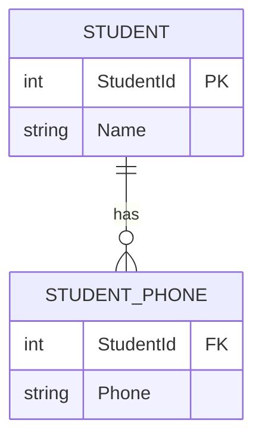
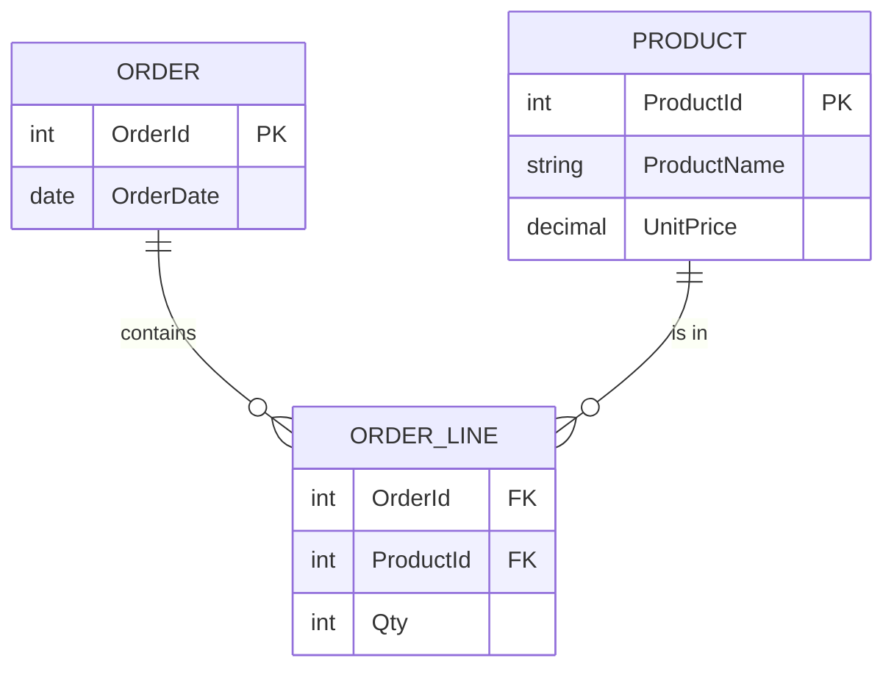
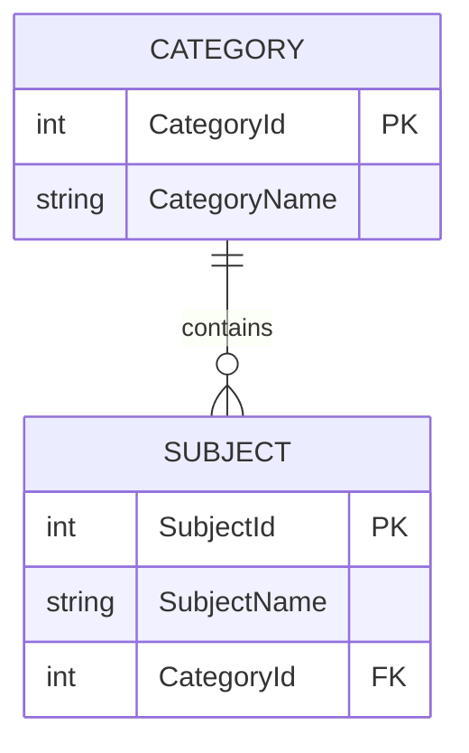
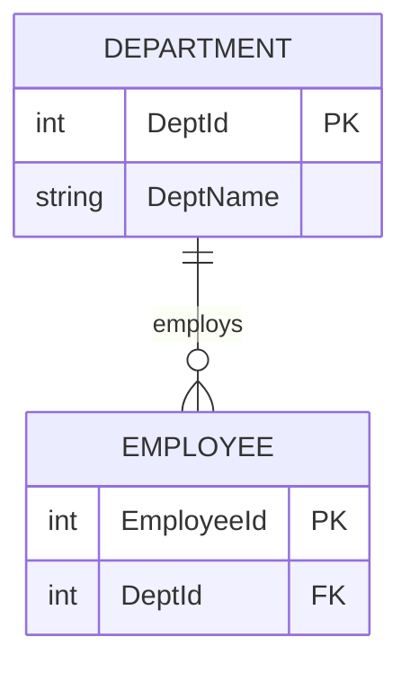
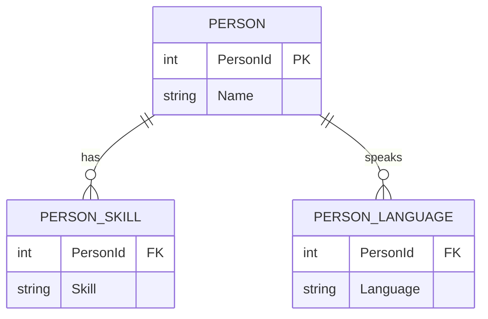
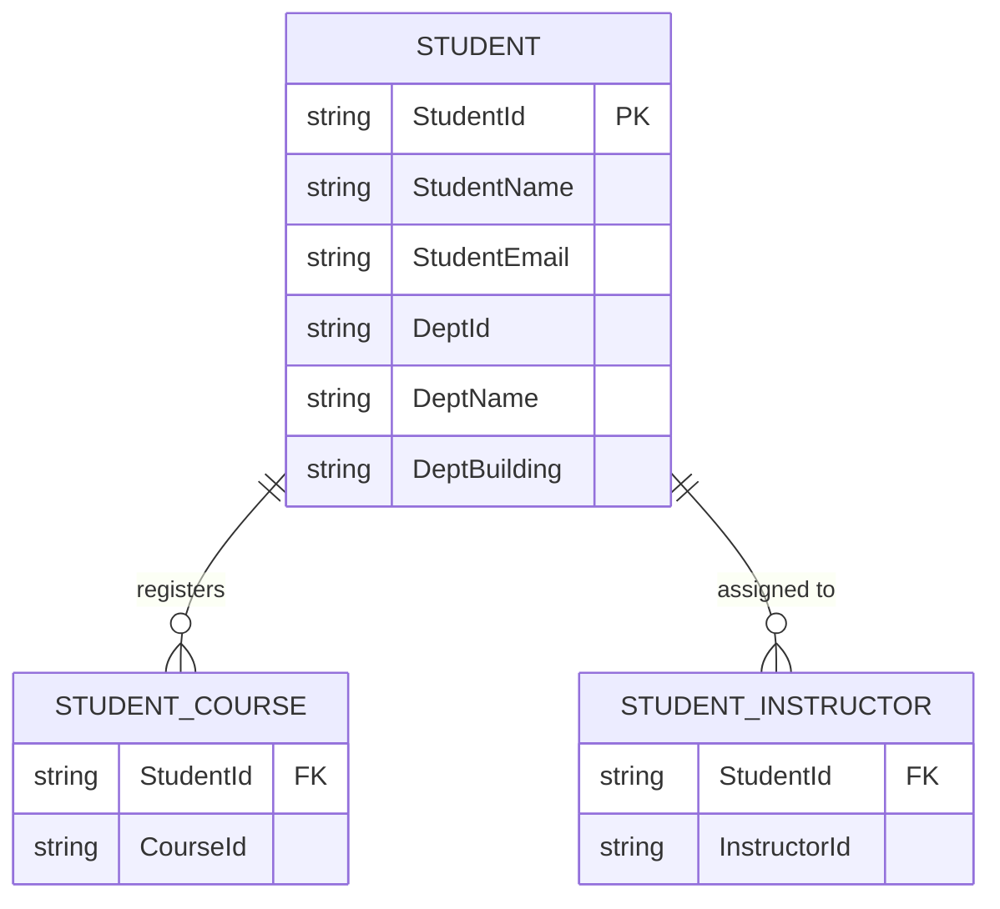
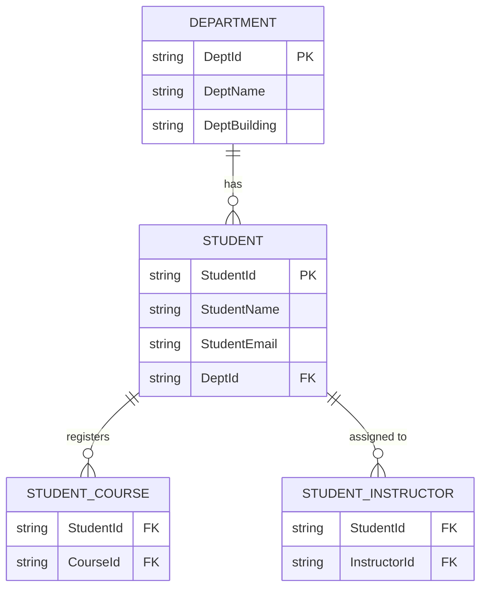

+++
title = 'Data Modeling & Normalization'
date = 2026-01-25T12:00:00+05:30
draft = false
tags = ['databases', 'data-modeling', 'normalization', 'design', 'erd']
summary = 'Comprehensive notes on data modeling process, ER diagrams, crow-foot notation, and normalization (1NF-5NF) with practical examples and denormalization guidelines.'
mermaid = true
+++

***

# Data Modeling Process

## What is Data Modeling?

**Data modeling** is the process of **analyzing data requirements** and **creating a structured design** that defines:

* what data is needed,
* how it relates,
* and how it will be stored and used.

### Why it matters

Data modeling helps you:

* reduce ambiguity in requirements,
* improve data quality and consistency,
* make databases easier to maintain,
* support reporting/analytics reliably.

## The Three Types of Data Models

Data modeling typically progresses through **three levels**:

1. **Conceptual Model** (high-level business view)
2. **Logical Model** (detailed structure, still tech-agnostic)
3. **Physical Model** (implementation in a specific database)

Think of it like:

> **Conceptual = “What?”**  
> **Logical = “How is it organized?”**  
> **Physical = “How is it implemented?”**

### 1) Conceptual Data Model (CDM)

#### Purpose

A **business-friendly** model that captures **core entities and relationships** without technical details.

#### Key Characteristics

* Focuses on **business concepts**
* Minimal attributes
* No database-specific details
* Used to align stakeholders and clarify scope

#### Typical Outputs

* High-level ER diagram
* Entities + relationships
* Business definitions (glossary)

#### Audience

* Business stakeholders
* Product owners
* Analysts

#### Example (E-commerce)

Entities:

* **Customer**
* **Order**
* **Product**

Relationships:

* Customer **places** Order
* Order **contains** Product

*No primary keys, no data types, no normalization yet.*

### 2) Logical Data Model (LDM)

#### Purpose

Defines the **detailed structure of data** and rules, but remains **database-agnostic**.

#### Key Characteristics

* Adds **attributes** to entities
* Defines **primary keys (PK)** and **foreign keys (FK)**
* Normalization is applied (often up to 3NF depending on needs)
* Captures business rules and constraints (e.g., cardinality)

#### Typical Outputs

* Logical ERD with:
  * attributes
  * PK/FK
  * cardinalities (1:1, 1:M, M:N)
* Data dictionary (definitions, constraints)

#### Audience

* Data analysts
* Data architects
* Developers (early design)

#### Example (E-commerce)

Customer

* CustomerID (PK)
* Name
* Email

Order

* OrderID (PK)
* OrderDate
* CustomerID (FK)

Product

* ProductID (PK)
* Name
* Price

OrderItem *(resolves M:N between Order and Product)*

* OrderID (FK)
* ProductID (FK)
* Quantity

Still *no* database indexes, partitioning, storage engine—those come next.

### 3) Physical Data Model (PDM)

#### Purpose

Specifies how the model will be **implemented in a specific DBMS** (SQL Server, PostgreSQL, Oracle, etc.).

#### Key Characteristics

* Includes **table names, columns, data types**
* Specifies **indexes**, constraints, default values
* Includes **performance considerations**
* DB-specific features:
  * partitioning
  * clustering
  * compression
  * storage parameters
  * schema/namespace

#### Typical Outputs

* SQL DDL scripts (`CREATE TABLE`, `CREATE INDEX`, etc.)
* Physical ERD
* Storage + performance plan

#### Audience

* DBAs
* Backend engineers
* Platform / DevOps (sometimes)

#### Example (Physical – SQL-ish)

```sql
CREATE TABLE Customer (
  CustomerID BIGINT PRIMARY KEY,
  Name       VARCHAR(100) NOT NULL,
  Email      VARCHAR(255) UNIQUE
);

CREATE TABLE [Order] (
  OrderID    BIGINT PRIMARY KEY,
  OrderDate  TIMESTAMP NOT NULL,
  CustomerID BIGINT NOT NULL,
  CONSTRAINT FK_Order_Customer
    FOREIGN KEY (CustomerID) REFERENCES Customer(CustomerID)
);

CREATE INDEX IX_Order_CustomerID ON CustomerID;
```

### How They Connect (CDM → LDM → PDM)

#### Mapping Summary

* **Conceptual**: entities + relationships (business terms)
* **Logical**: entities + attributes + keys + normalization
* **Physical**: tables + columns + types + indexes + constraints

#### Rule of thumb

As you move forward:

* **detail increases**
* **technical specificity increases**
* **audience shifts from business → engineering**

### Quick Comparison Cheat Sheet

#### Conceptual

* **Goal:** align business understanding
* **Includes:** entities, relationships
* **Excludes:** attributes, keys, data types

#### Logical

* **Goal:** precise structure + rules
* **Includes:** attributes, PK/FK, normalization
* **Excludes:** DB-specific performance/storage

#### Physical

* **Goal:** implementation-ready blueprint
* **Includes:** tables, columns, types, indexes, partitions
* **Includes:** DBMS-specific features

### Mini Self-Check Questions

Use these to test your understanding:

* **Conceptual:** Can a non-technical stakeholder understand it?
* **Logical:** Does it clearly define keys, constraints, and resolve M:N relationships?
* **Physical:** Can you generate DDL and consider performance (indexes, partitioning)?

### Determining The Goal Of The Database

* What the goal of this database, what is it trying to achieve.
* Determining the goal of the database helps you determine what needs to be stored.
* You should have some kind of scope or boundary for what you to or need to be stored.

### Consider The Curent System

* Identify the problems with the current system or database (data quality, missing data).

### Future Growth

* Databases should cater for future growth (data type and size should allow for it).
* Should last many years.
* Technology may change, data model should be same.

### Exceptions

* Finding exceptions to the rules during your design phase is important.
* Determine if there are any exceptions to your requirements.
* Watch out for the word "usually".
* Question any specific field length or type restriction.

## Entities and Attributes in Database Design

### Entities

An **entity** is a real-world object or concept that a database needs to store information about.  
In practice, entities become **tables** in a database.

**Examples:** Customer, Order, Product, Employee

### Attributes

An **attribute** is a detail that describes an entity.  
Attributes become **columns** in a table.

**Examples:**

* For Customer → CustomerID, Name, Email
* For Product → ProductID, Price, Category

### Best Practices (Crisp & Practical)

#### When defining **Entities**

* Identify only *business‑relevant* objects—avoid unnecessary tables.
* Name entities in **singular form** (Customer, not Customers).
* Ensure each entity has a **clear purpose** and fits one logical concept.
* Avoid mixing unrelated concepts in one entity (e.g., Customer + Address in same table).

#### When defining **Attributes**

* Always include a **primary key** (natural or surrogate) that uniquely identifies each record.
* Use **clear, meaningful names** (OrderDate, not Date1).
* Choose **correct data types** early (e.g., decimal for money, date for dates).
* Avoid storing **derived/calculated attributes** unless necessary for performance.
* Maintain **atomic attributes** (break full name into FirstName, LastName if needed).

#### General Modeling Best Practices

* Follow **normalization** (at least 1NF–3NF) to reduce redundancy.
* Keep entities loosely coupled with **well-defined relationships**.
* Add attributes only if they serve a real reporting or operational need.
* Document entities and attributes with short, clear definitions.

### Relationship Notation Cheat Sheet (Crow-Foot Notation)

Crow-foot notation (also called Information Engineering notation) is the standard way to show relationships in ERDs.

#### Symbol Components

Each relationship line has **two ends**, and each end shows:

1. **Cardinality** (how many) — closest to the entity box
2. **Modality/Optionality** (required or optional) — furthest from the entity box

#### Cardinality Symbols (Inner, closest to entity)

* **`|`** (single line) = **One** (exactly one)
* **`<`** (crow's foot) = **Many** (zero or more)

#### Modality Symbols (Outer, away from entity)

* **`|`** (single line) = **Mandatory** (must exist)
* **`o`** (circle) = **Optional** (may or may not exist)

#### Combined Notation Patterns

```text
Symbol   Meaning                    Read as
------   -------                    -------
||       One and only one           Mandatory one
o|       Zero or one                Optional one
|<       One or more                Mandatory many
o<       Zero or more               Optional many
```

#### Common Relationship Patterns

##### One-to-One (1:1)

```text
PERSON ||--|| PASSPORT
```

* One person has exactly one passport
* One passport belongs to exactly one person

##### One-to-Many (1:M)

```text
CUSTOMER ||--o{ ORDER
```

* One customer can have zero or more orders
* Each order must belong to exactly one customer

##### Many-to-Many (M:N) — Resolved with Junction Table

```text
STUDENT }o--o{ COURSE
```

**After normalization (recommended):**

```text
STUDENT ||--o{ ENROLLMENT : enrolls-in
COURSE  ||--o{ ENROLLMENT : has
```

##### Optional One-to-Many

```text
DEPARTMENT ||--o{ EMPLOYEE
```

* One department can have zero or more employees
* Each employee must belong to exactly one department

##### Mandatory One-to-Many

```text
ORDER ||--|{ ORDER_LINE
```

* One order must have one or more order lines
* Each order line belongs to exactly one order

#### Visual Reference Card

```text
┌──────────────┬────────────────────────────────────┐
│ Notation     │ Meaning                            │
├──────────────┼────────────────────────────────────┤
│ Entity ||    │ Mandatory relationship (must have) │
│ Entity o|    │ Optional relationship (may have)   │
│ Entity |<    │ Mandatory many (one or more)       │
│ Entity o<    │ Optional many (zero or more)       │
└──────────────┴────────────────────────────────────┘

Reading relationships left-to-right:
  A ||--o{ B  =  "One A has zero or more B"
               =  "Each B belongs to exactly one A"
```

#### Practical Examples

##### E-commerce System

```text
CUSTOMER ||--o{ ORDER       : places
ORDER    ||--|{ ORDER_LINE  : contains
PRODUCT  ||--o{ ORDER_LINE  : appears-in
CUSTOMER ||--o{ ADDRESS     : has
```

**Translation:**

* A customer can place zero or more orders
* An order must have at least one order line
* A product can appear in zero or more order lines
* A customer can have zero or more addresses

##### University System

```text
DEPARTMENT ||--o{ COURSE     : offers
INSTRUCTOR ||--o{ COURSE     : teaches
STUDENT    ||--o{ ENROLLMENT : registers
COURSE     ||--o{ ENROLLMENT : has
```

**Translation:**

* A department can offer zero or more courses
* An instructor can teach zero or more courses
* A student can register for zero or more enrollments
* A course can have zero or more enrollments

#### Tips for Reading Crow-Foot Diagrams

1. **Start from the entity you're asking about**
2. **Read the symbols closest to that entity first** (cardinality)
3. **Then check if it's mandatory or optional** (modality)
4. **Flip and read from the other direction** for the complete picture

**Example:**

```text
AUTHOR ||--o{ BOOK
```

Reading from AUTHOR:
"One author has zero or more books" (an author may not have written any books yet)

Reading from BOOK:
"Each book belongs to exactly one author" (every book must have an author)

***

## Normalization (Relational Database Design

### What is Normalization?

**Normalization** is the process of structuring relational data to **reduce redundancy** and **prevent update/insert/delete anomalies**, by organizing data into tables that reflect clear dependencies and relationships.

#### Why it matters

* Prevents inconsistent duplicate values (same fact stored in multiple places).
* Makes updates safe (change once, not everywhere).
* Keeps relationships explicit and enforceable (keys + constraints).
* Improves long-term maintainability (especially in OLTP systems).

#### How to tell if data is “normalized”

A schema is “normalized to **N-th Normal Form**” when it satisfies **all normal forms up to N**.

> Example: If a schema is in **3NF**, it is also in **1NF** and **2NF**.

A practical mindset:

* **1NF:** “Are values atomic and rows well-formed?”
* **2NF:** “Does every non-key attribute depend on the whole key?”
* **3NF:** “Do non-key attributes depend only on the key (not on other non-keys)?”
* **BCNF:** “Is every determinant a candidate key?”
* **4NF:** “Are independent multi-valued facts split apart?”
* **5NF:** “Are there join dependencies that force decomposition?”

#### Common anomalies (what normalization prevents)

* **Update anomaly:** changing a repeated fact requires updating many rows → inconsistent states.
* **Insert anomaly:** cannot insert a fact because unrelated fact is missing.
* **Delete anomaly:** deleting a row accidentally deletes a needed fact.

#### Quick glossary (used below)

* **Key / Candidate key:** minimal attribute set that uniquely identifies a row.
* **PK:** chosen candidate key.
* **Determinant:** an attribute/set that determines another attribute (X → Y).
* **Functional dependency (FD):** X → Y (X uniquely determines Y).
* **MVD (multi-valued dependency):** X ↠ Y (for one X, multiple Ys independent of other attributes).

#### Quick Reference Table (All Normal Forms)

```text
┌───────┬─────────────────────────────┬────────────────────────────────┬─────────────────────────────────┐
│ Form  │ Violation                   │ Fix                            │ Key Question                    │
├───────┼─────────────────────────────┼────────────────────────────────┼─────────────────────────────────┤
│ 1NF   │ Multi-valued columns,       │ Split into child table,        │ Are all values atomic?          │
│       │ repeating groups            │ ensure PK exists               │                                 │
├───────┼─────────────────────────────┼────────────────────────────────┼─────────────────────────────────┤
│ 2NF   │ Partial dependency          │ Move attributes to table       │ Does every non-key depend on    │
│       │ (attr depends on part of    │ where that key-part is PK      │ the WHOLE key?                  │
│       │ composite PK)               │                                │                                 │
├───────┼─────────────────────────────┼────────────────────────────────┼─────────────────────────────────┤
│ 3NF   │ Transitive dependency       │ Extract into lookup table      │ Do non-keys depend only on      │
│       │ (non-key → non-key)         │ keyed by the determinant       │ keys (not other non-keys)?      │
├───────┼─────────────────────────────┼────────────────────────────────┼─────────────────────────────────┤
│ BCNF  │ Non-key determinant         │ Make determinant a key in      │ Is every determinant a          │
│       │ (X → Y where X not a key)   │ its own table                  │ candidate key?                  │
├───────┼─────────────────────────────┼────────────────────────────────┼─────────────────────────────────┤
│ 4NF   │ Independent MVDs            │ Split independent multi-valued │ Are multi-valued facts          │
│       │ (X ↠ Y, X ↠ Z independent)  │ facts into separate tables     │ independent of each other?      │
├───────┼─────────────────────────────┼────────────────────────────────┼─────────────────────────────────┤
│ 5NF   │ Join dependency             │ Decompose only if lossless     │ Does decomposition create       │
│       │ (ternary can't be split)    │ and business rules allow       │ spurious tuples on rejoin?      │
└───────┴─────────────────────────────┴────────────────────────────────┴─────────────────────────────────┘
```

**Hierarchy:** 1NF ⊂ 2NF ⊂ 3NF ⊂ BCNF ⊂ 4NF ⊂ 5NF

**Practical target:** Most OLTP systems aim for **3NF** (or BCNF if business rules demand it).

***

### 1NF — First Normal Form

#### When is something in 1NF?

A table is in **1NF** if:

* Each column contains **atomic** (indivisible) values (no lists/arrays/CSV strings).
* Each row is uniquely identifiable (a **key** exists).
* No repeating groups like `Phone1, Phone2, Phone3`.

#### When 1NF is used

* Always used as the **baseline** for relational design (OLTP and reporting staging).
* Used when you see:
  * comma-separated values in a column,
  * repeated “slot” columns (`Item1, Item2, Item3`),
  * “multi-value” cells that require parsing.

#### 1NF checklist / recipe

* Find columns that hold multiple values (lists).
* Split repeating groups into a **child table**.
* Ensure each table has a **primary key**.

#### Short, effective example (1NF)

**Not 1NF** (multi-valued column):

```text
Student(StudentId, Name, Phones)
1, "Asha", "9001,9002"
```

**1NF fix**:

```text
Student(StudentId, Name)
1, "Asha"

StudentPhone(StudentId, Phone)
1, "9001"
1, "9002"
```

##### Mermaid (after 1NF)



***

### 2NF — Second Normal Form

#### When is something in 2NF?

A table is in **2NF** if:

* It is already in **1NF**, and
* Every non-key attribute depends on the **entire** primary key (no **partial dependency**).

> Partial dependency only happens when the PK is **composite** (e.g., (OrderId, ProductId)).

#### When 2NF is used

* Used when you have **composite primary keys** (common in junction tables, line items).
* Used when you notice:
  * attributes that “belong to” only one part of the composite key,
  * repeated descriptive data across many line rows (product name repeated per order line).

#### 2NF checklist / recipe

* Identify the **primary key** (especially if composite).
* For each non-key attribute, ask:\
    “Does this depend on the whole key, or only part of it?”
* If it depends on part → move it to a new table where that part is the key.

#### Short, effective example (2NF)

**Not 2NF**:

```text
OrderLine(OrderId, ProductId, ProductName, UnitPrice, Qty)
PK = (OrderId, ProductId)

ProductName and UnitPrice depend only on ProductId (part of the key).
```

**2NF fix**:

```text
Product(ProductId, ProductName, UnitPrice)

OrderLine(OrderId, ProductId, Qty)
PK = (OrderId, ProductId)
```

##### Mermaid (after 2NF)



#### Determining Foreign Key Placement

After splitting a table during normalization, you need to establish the relationship between the new tables. Use this question:

> **"Does table1 have many table2s, or does table2 have many table1s?"**

The table on the **"many" side** gets the foreign key pointing to the "one" side.

##### Example: Category and Subject

After normalizing, you have two tables: `Category` and `Subject`. Ask:

* Does a subject have many categories? No.
* Does a category have many subjects? **Yes.**

Since a category has many subjects, the **Subject table** gets the `CategoryId` foreign key.



##### General Rule

```text
┌─────────────────────────────────────────────────────────────┐
│ If A has many B → B gets the FK pointing to A               │
│ If B has many A → A gets the FK pointing to B               │
│ If both have many of each other → junction table needed     │
└─────────────────────────────────────────────────────────────┘
```

This same question applies whenever you decompose tables during any normalization step (1NF, 2NF, 3NF).

***

### 3NF — Third Normal Form

#### When is something in 3NF?

A table is in **3NF** if:

* It is already in **2NF**, and
* No non-key attribute depends on another non-key attribute (**no transitive dependency**).

Practical test:

* If you can say **PK → A** and **A → B**, and **B** is not a key attribute → you likely violate 3NF.

#### When 3NF is used

* Used as the **practical target for most OLTP schemas**.
* Used when you see “lookup data” embedded in transactional tables:
  * `DeptName` stored in `Employee`,
  * `CityName` stored with `ZipCode`,
  * `CustomerTierName` stored on every order.

#### 3NF checklist / recipe

* List non-key attributes.
* For each non-key attribute **A**, ask:\
    “Does A determine some other non-key attribute B?”
* If yes → split: move B into a table keyed by A (or by a proper key).

#### Short, effective example (3NF)

**Not 3NF**:

```text
Employee(EmployeeId, DeptId, DeptName)
PK = EmployeeId

DeptId -> DeptName (non-key determines non-key)
So EmployeeId -> DeptId -> DeptName (transitive dependency)
```

**3NF fix**:

```text
Employee(EmployeeId, DeptId)

Department(DeptId, DeptName)
```

##### Mermaid (after 3NF)



#### The Codd Mnemonic

A famous way to remember the first three normal forms:

> **"The key, the whole key, and nothing but the key, so help me Codd."**

* **The key** (1NF) — every table must have a primary key
* **The whole key** (2NF) — non-key attributes must depend on the *entire* key, not just part of it
* **Nothing but the key** (3NF) — non-key attributes must depend *only* on the key, not on other non-key attributes

#### Smell Test for 3NF Violations

> **"If changing one non-key value forces you to change another non-key value in the same row, you likely have a 3NF violation."**

Example: If updating `DeptId` in an `Employee` row means you must also update `DeptName` to stay consistent → transitive dependency → violates 3NF.

***

### BCNF — Boyce–Codd Normal Form

#### When is something in BCNF?

A table is in **BCNF** if:

* For every functional dependency **X → Y**, **X** is a **superkey** (i.e., X uniquely identifies a row).

Why BCNF exists:

* 3NF can still allow subtle redundancy when **a non-key determinant** exists.

#### When BCNF is used

* Used when there are **non-obvious business rules** that create functional dependencies:
  * “Each employee belongs to exactly one union branch” (branch determines something else),
  * “Each instructor teaches exactly one course”.
* Used when 3NF still leaves:
  * duplication that causes anomalies,
  * determinants that aren’t modeled as keys.

#### BCNF checklist / recipe

* Identify real functional dependencies (business rules), not just “what happens today”.
* For each FD **X → Y**, check if **X** is a candidate key.
* If not, decompose so that determinants become keys in their own tables.

#### Short, effective example (BCNF)

Business rule: *each instructor teaches exactly one course; a course may have many instructors.*

**Not BCNF**:

```text
Teaching(Instructor, Course, Room)
FD: Instructor -> Course
But (Instructor, Room) might be treated as the key while Instructor isn't modeled as a key,
creating redundancy and anomalies.
```

**BCNF fix (one valid approach)**:

```text
InstructorCourse(Instructor, Course)   // Instructor is key here
CourseRoom(Course, Room)              // if room depends on course (or course+slot)
```

> BCNF decompositions depend on actual rules; the key is spotting “determinant not a key”.

***

### 4NF — Fourth Normal Form (Multi-valued dependencies)

#### When is something in 4NF?

A table is in **4NF** if:

* It is in **BCNF**, and
* It has **no non-trivial multi-valued dependencies** except those where the determinant is a key.

When 4NF matters:

* When one entity has **two independent multi-valued facts**, and you store them together causing combinatorial duplication.

#### When 4NF is used

* Used when you model:
  * “people have many skills and many languages” (independent lists),
  * “products have many tags and many suppliers” (independent lists),
  * any scenario where lists multiply into redundant combinations.
* Used when you see a table whose row count explodes due to **cross-product duplication**.

#### 4NF checklist / recipe

* Look for tables where a key (X) has multiple values of Y and multiple values of Z **independently**.
* If Y and Z are independent, split into:
  * X–Y and X–Z tables.

#### Short, effective example (4NF)

**Not 4NF** (independent multi-valued attributes):

```text
PersonSkillLanguage(PersonId, Skill, Language)

One person can have many skills and many languages, independently.
This creates redundant combinations (every skill paired with every language).
```

**4NF fix**:

```text
PersonSkill(PersonId, Skill)
PersonLanguage(PersonId, Language)
```

##### Mermaid (after 4NF)



#### Smell Test for 4NF Violations (Cartesian Explosion)

> **"If your row count equals the product of two independent list sizes, you likely have a 4NF violation."**

Example: A person has 3 skills and 4 languages.

* **4NF violation:** `PersonSkillLanguage` table has 3 × 4 = **12 rows** (every skill paired with every language)
* **4NF compliant:** `PersonSkill` has **3 rows** + `PersonLanguage` has **4 rows** = **7 rows total**

```text
┌────────────────────────────────────────────────────────────────┐
│ Quick check: rows = listA_size × listB_size?                   │
│ If yes → the lists are probably independent → split them       │
└────────────────────────────────────────────────────────────────┘
```

The Cartesian explosion wastes storage and creates update anomalies (adding a new skill requires adding rows for every language).

***

### 5NF — Fifth Normal Form (Join dependencies; rare)

#### When is something in 5NF?

A table is in **5NF** if:

* It cannot be decomposed further without losing information, and
* Any join dependency is implied by candidate keys (decompositions are lossless and necessary).

When 5NF appears:

* In complex “three-way relationship” cases where storing all combinations creates redundancy, but decomposing must be done carefully to avoid generating invalid combinations upon re-join.

#### When 5NF is used

* Used in rare cases with **ternary relationships** and strict business constraints:
  * Supplier–Part–Project style relationships where not all combinations are valid.
* Used when:
  * a 3-column relationship table contains redundancy, and
  * naive decomposition into binary tables creates **spurious (invalid) combinations** after re-joining.

#### 5NF checklist / recipe (practical)

* If you see a table representing a **ternary relationship** (A–B–C), ask:
  * Are all combinations valid?
  * Or are there constraints that make some combinations invalid?
* Test decomposition:
  * If splitting into three binary relations and joining them back creates rows that never existed → 5NF concern.
* Apply 5NF only when:
  * the business constraints are well-defined,
  * you can prove joins don’t invent invalid combinations.

#### Short example (intuition)

```text
SupplierPartProject(Supplier, Part, Project)

If you decompose to:
SupplierPart(Supplier, Part)
SupplierProject(Supplier, Project)
PartProject(Part, Project)

Joining can generate Supplier-Part-Project combinations that were never valid in reality.
```

> 5NF is uncommon in everyday OLTP; it's mainly for specialized modeling.

***

### Running Example: Course Registration System (1NF → 3NF)

This example uses **one consistent scenario** to show how normalization progressively improves a schema.

#### Starting Point: Unnormalized Data

```text
CourseRegistration(
  StudentId, StudentName, StudentEmail,
  Courses,                              -- "CS101,CS102,CS103"
  InstructorIds,                        -- "I01,I02"
  DeptId, DeptName, DeptBuilding
)
```

**Sample row:**

```text
(S001, "Asha", "asha@uni.edu", "CS101,CS102", "I01,I02", D01, "Computer Science", "Tech Hall")
```

**Problems:**

* `Courses` and `InstructorIds` are comma-separated lists
* `DeptName` and `DeptBuilding` repeat for every student in that dept
* Can't easily query "all students in CS101"

***

#### Step 1: Apply 1NF (Atomic Values)

**Violation:** Multi-valued columns (`Courses`, `InstructorIds`)

**Fix:** Split lists into child tables

```text
Student(StudentId, StudentName, StudentEmail, DeptId, DeptName, DeptBuilding)

StudentCourse(StudentId, CourseId)

StudentInstructor(StudentId, InstructorId)
```



**Result:** 1NF — all values atomic, PKs defined

**Remaining problems:** `DeptName`, `DeptBuilding` still duplicated per student

***

#### Step 2: Apply 2NF (No Partial Dependencies)

**Check:** Does `Student` have a composite PK? No — PK is just `StudentId`.

**Result:** Already in 2NF (2NF only applies when composite keys exist)

> Note: If `StudentCourse` had `CourseName` stored in it, that would be a 2NF violation (CourseName depends only on CourseId, not the full key StudentId+CourseId).

***

#### Step 3: Apply 3NF (No Transitive Dependencies)

**Violation:** In `Student` table:

```text
StudentId → DeptId → DeptName, DeptBuilding
```

`DeptName` and `DeptBuilding` depend on `DeptId`, not directly on `StudentId` (transitive dependency).

**Fix:** Extract `Department` as its own table

```text
Student(StudentId, StudentName, StudentEmail, DeptId)

Department(DeptId, DeptName, DeptBuilding)

StudentCourse(StudentId, CourseId)

StudentInstructor(StudentId, InstructorId)
```



**Result:** 3NF — no transitive dependencies, each fact stored once

***

#### Summary: Before and After

| Aspect              | Before (Unnormalized)            | After (3NF)                     |
|---------------------|----------------------------------|---------------------------------|
| **Redundancy**      | DeptName repeated per student    | DeptName stored once            |
| **Update anomaly**  | Change dept name in many rows    | Change in one place             |
| **Insert anomaly**  | Can't add dept without students  | Dept exists independently       |
| **Delete anomaly**  | Delete last student loses dept   | Dept preserved                  |
| **Query ease**      | Parse CSV to find courses        | Simple JOIN on StudentCourse    |

***

### Normalization "recipes" — step-by-step workflow (real-project friendly)

#### Recipe A: Fast 1NF → 3NF normalization

##### Step 1: Make it 1NF

* Remove repeating groups / lists into child tables.
* Ensure each table has a primary key.

##### Step 2: Make it 2NF (only if composite keys exist)

* For composite keys, move attributes dependent on **part** of the key into separate tables.

##### Step 3: Make it 3NF

* Extract attributes that depend on other non-key attributes (transitive dependencies).

##### Step 4: Add constraints

* Add uniqueness, required-ness, relationships, and simple domain rules:
  * `UNIQUE`, `NOT NULL`, FKs, `CHECK`.

##### Step 5: Validate with anomaly tests

* Ask:
  * Can I update a fact in one place only?
  * Can I insert an entity without unrelated info?
  * Can I delete a record without losing unrelated facts?

***

### “How do I know which NF I’m at?” — quick tests

* **1NF test:** any column storing multiple values? any repeating columns?
* **2NF test:** any non-key attribute depends only on a subset of a composite PK?
* **3NF test:** any non-key attribute depends on another non-key attribute?
* **BCNF test:** any FD where determinant isn’t a candidate key?
* **4NF test:** independent multi-valued lists causing cross-product duplication?
* **5NF test:** ternary relationship where decomposition creates invalid recombinations?

***

### Practical best practices (OLTP + Reporting)

#### OLTP (transactional systems)

* Normalize to **3NF** (often enough for correctness).
* Apply **BCNF** when business rules create determinants that aren’t keys.
* Add constraints early; they’re part of the model.
* Denormalize only with measured performance reasons + a clear maintenance strategy.

#### Reporting (analytics)

* Don't force OLTP normalization into reporting models.
* Use **star schema** (facts + dimensions), intentionally denormalized for query speed and usability.
* Keep OLTP as source of truth; build reporting projections with CDC/ETL/ELT.

### When to Denormalize (Decision Guide)

Denormalization means **intentionally breaking normal form rules** to optimize for specific use cases. It's a trade-off, not a failure.

#### When Denormalization Makes Sense

| Scenario                            | Why Denormalize                            | Example                                    |
|-------------------------------------|--------------------------------------------|--------------------------------------------|
| **Read-heavy dashboards**           | Avoid expensive JOINs on every request     | Store `CustomerName` on `Order` table      |
| **Reporting/Analytics**             | Star schema is faster for aggregations     | Dimension tables with flattened attributes |
| **Caching derived values**          | Avoid repeated calculations                | Store `OrderTotal` instead of computing    |
| **Historical snapshots**            | Preserve point-in-time values              | Store `Price` at time of order (not FK)    |
| **Reducing latency-critical JOINs** | Sub-millisecond reads can't afford JOINs   | Embed lookup values in hot tables          |
| **Simplifying queries**             | Analysts can query without complex JOINs   | Pre-joined summary tables                  |

#### When NOT to Denormalize

| Scenario                          | Why Stay Normalized                         |
|-----------------------------------|---------------------------------------------|
| **Write-heavy OLTP**              | Updates become complex (multiple places)    |
| **Data frequently changes**       | Keeping denormalized copies in sync is hard |
| **No measured performance issue** | Premature optimization adds complexity      |
| **Source of truth / master data** | Normalization ensures single source         |
| **Compliance/audit requirements** | Redundancy can cause conflicting records    |

#### Denormalization Checklist (Before You Do It)

Ask yourself:

1. **Is there a measured problem?**
   * Don't denormalize based on assumptions — profile first
   * Identify the specific query/latency issue

2. **What is the source of truth?**
   * Which table holds the "real" value?
   * Document this clearly

3. **How will you keep data in sync?**
   * Synchronous (same transaction)?
   * Async trigger/event?
   * Batch refresh?

4. **What's the acceptable staleness?**
   * Real-time (must be same transaction)?
   * Seconds? Minutes? Hours?

5. **What happens when source changes?**
   * Do you need to update historical records?
   * Or preserve point-in-time values?

#### Common Denormalization Patterns

##### 1. Cached Aggregates

```text
-- Normalized: calculate on every read
SELECT COUNT(*) FROM OrderLine WHERE OrderId = ?

-- Denormalized: store count on Order
Order(OrderId, ..., LineItemCount)
-- Update LineItemCount when lines change
```

**Sync strategy:** Trigger or application code on insert/delete

##### 2. Snapshot Values (Point-in-Time)

```text
-- Normalized: always get current price
OrderLine(OrderId, ProductId, Qty)
JOIN Product ON ... to get Price

-- Denormalized: capture price at order time
OrderLine(OrderId, ProductId, Qty, UnitPriceAtOrder)
```

**Rationale:** Price changes shouldn't affect past orders

##### 3. Embedded Lookup (Avoid JOINs)

```text
-- Normalized
Order(OrderId, CustomerId, ...)
JOIN Customer to get CustomerName

-- Denormalized (for display/reports)
Order(OrderId, CustomerId, CustomerName, ...)
```

**Sync strategy:** Update on customer name change (or accept staleness)

##### 4. Materialized Views / Summary Tables

```text
-- Base tables stay normalized
-- Create pre-joined summary for reporting
DailySalesSummary(Date, ProductId, ProductName, CategoryName, TotalQty, TotalRevenue)
```

**Sync strategy:** Nightly rebuild or incremental refresh

#### Red Flags: Signs of Bad Denormalization

* Multiple "sources of truth" with no clear owner
* No documented sync strategy
* Inconsistent values found during audits
* Updates require touching many tables
* "We denormalized because JOINs are slow" (without measuring)

> **Golden rule:** Denormalize with intention, document the trade-off, and maintain sync discipline.

### Mini Self-Check Questions

* Can I update a business fact in exactly one place?
* Do any columns contain lists or repeated groups?
* In composite-key tables, are there attributes that belong to only one part of the key?
* Do I have attributes describing other attributes (e.g., DeptName inside Employee)?
* Are any independent multi-valued lists causing duplicate combinations?

***

## Next: Enterprise Design Patterns

For production-grade patterns covering OLTP, dimensional modeling, transactions, concurrency, data pipelines, and schema evolution, see **[Enterprise Database Design Patterns](enterprise-database-design-patterns.md)**.
