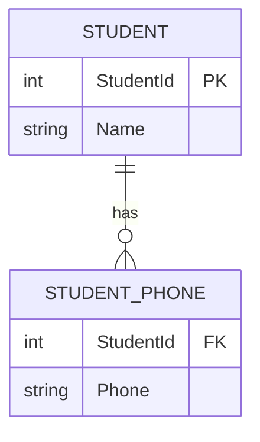
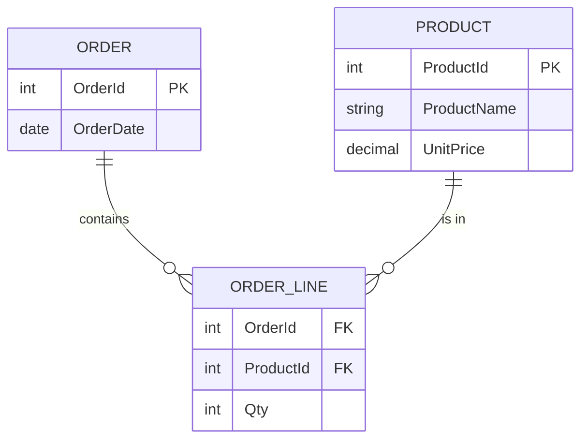
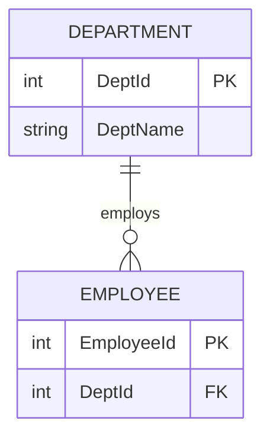
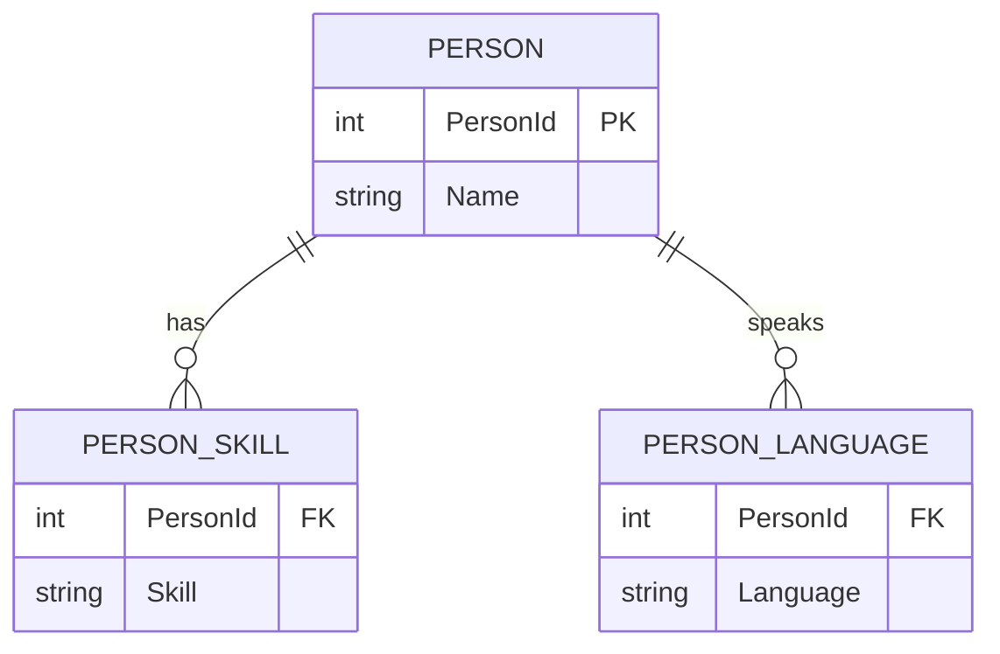

+++
title = 'Database Design'
date = 2026-01-23T01:49:28+05:30
draft = false
tags = ['databases', 'data-modeling', 'normalization', 'design']
summary = 'Comprehensive notes on data modeling process, normalization (1NF-5NF), and enterprise database design patterns for OLTP and reporting.'
mermaid = true
+++

***
# Data Modeling Process

## ✅ What is Data Modeling?

**Data modeling** is the process of **analyzing data requirements** and **creating a structured design** that defines:

*   what data is needed,
*   how it relates,
*   and how it will be stored and used.

### Why it matters

Data modeling helps you:

*   reduce ambiguity in requirements,
*   improve data quality and consistency,
*   make databases easier to maintain,
*   support reporting/analytics reliably.

## ✅ The Three Types of Data Models

Data modeling typically progresses through **three levels**:

1.  **Conceptual Model** (high-level business view)
2.  **Logical Model** (detailed structure, still tech-agnostic)
3.  **Physical Model** (implementation in a specific database)

Think of it like:

> **Conceptual = “What?”**  
> **Logical = “How is it organized?”**  
> **Physical = “How is it implemented?”**

### 1) Conceptual Data Model (CDM)

#### Purpose

A **business-friendly** model that captures **core entities and relationships** without technical details.

#### Key Characteristics

*   Focuses on **business concepts**
*   Minimal attributes
*   No database-specific details
*   Used to align stakeholders and clarify scope

#### Typical Outputs

*   High-level ER diagram
*   Entities + relationships
*   Business definitions (glossary)

#### Audience

*   Business stakeholders
*   Product owners
*   Analysts

#### Example (E-commerce)

Entities:

*   **Customer**
*   **Order**
*   **Product**

Relationships:

*   Customer **places** Order
*   Order **contains** Product

✅ *No primary keys, no data types, no normalization yet.*


### 2) Logical Data Model (LDM)

#### Purpose

Defines the **detailed structure of data** and rules, but remains **database-agnostic**.

#### Key Characteristics

*   Adds **attributes** to entities
*   Defines **primary keys (PK)** and **foreign keys (FK)**
*   Normalization is applied (often up to 3NF depending on needs)
*   Captures business rules and constraints (e.g., cardinality)

#### Typical Outputs

*   Logical ERD with:
    *   attributes
    *   PK/FK
    *   cardinalities (1:1, 1:M, M:N)
*   Data dictionary (definitions, constraints)

#### Audience

*   Data analysts
*   Data architects
*   Developers (early design)

#### Example (E-commerce)

Customer

*   CustomerID (PK)
*   Name
*   Email

Order

*   OrderID (PK)
*   OrderDate
*   CustomerID (FK)

Product

*   ProductID (PK)
*   Name
*   Price

OrderItem *(resolves M:N between Order and Product)*

*   OrderID (FK)
*   ProductID (FK)
*   Quantity

✅ Still *no* database indexes, partitioning, storage engine—those come next.

### 3) Physical Data Model (PDM)

#### Purpose

Specifies how the model will be **implemented in a specific DBMS** (SQL Server, PostgreSQL, Oracle, etc.).

#### Key Characteristics

*   Includes **table names, columns, data types**
*   Specifies **indexes**, constraints, default values
*   Includes **performance considerations**
*   DB-specific features:
    *   partitioning
    *   clustering
    *   compression
    *   storage parameters
    *   schema/namespace

#### Typical Outputs

*   SQL DDL scripts (`CREATE TABLE`, `CREATE INDEX`, etc.)
*   Physical ERD
*   Storage + performance plan

#### Audience

*   DBAs
*   Backend engineers
*   Platform / DevOps (sometimes)

#### Example (Physical – SQL-ish)

```sql
CREATE TABLE Customer (
  CustomerID BIGINT PRIMARY KEY,
  Name       VARCHAR(100) NOT NULL,
  Email      VARCHAR(255) UNIQUE
);

CREATE TABLE [Order] (
  OrderID    BIGINT PRIMARY KEY,
  OrderDate  TIMESTAMP NOT NULL,
  CustomerID BIGINT NOT NULL,
  CONSTRAINT FK_Order_Customer
    FOREIGN KEY (CustomerID) REFERENCES Customer(CustomerID)
);

CREATE INDEX IX_Order_CustomerID ON CustomerID;
```

### 🔁 How They Connect (CDM → LDM → PDM)

#### Mapping Summary

*   **Conceptual**: entities + relationships (business terms)
*   **Logical**: entities + attributes + keys + normalization
*   **Physical**: tables + columns + types + indexes + constraints

#### Rule of thumb

As you move forward:

*   **detail increases**
*   **technical specificity increases**
*   **audience shifts from business → engineering**

### 🧠 Quick Comparison Cheat Sheet

#### Conceptual

*   **Goal:** align business understanding
*   **Includes:** entities, relationships
*   **Excludes:** attributes, keys, data types

#### Logical

*   **Goal:** precise structure + rules
*   **Includes:** attributes, PK/FK, normalization
*   **Excludes:** DB-specific performance/storage

#### Physical

*   **Goal:** implementation-ready blueprint
*   **Includes:** tables, columns, types, indexes, partitions
*   **Includes:** DBMS-specific features

### ✅ Mini Self-Check Questions

Use these to test your understanding:

*   **Conceptual:** Can a non-technical stakeholder understand it?
*   **Logical:** Does it clearly define keys, constraints, and resolve M:N relationships?
*   **Physical:** Can you generate DDL and consider performance (indexes, partitioning)?

### Determining The Goal Of The Database

- What the goal of this database, what is it trying to achieve.
- Determining the goal of the database helps you determine what needs to be stored.
- You should have some kind of scope or boundary for what you to or need to be stored.

### Consider The Curent System

- Identify the problems with the current system or database (data quality, missing data).

### Future Growth

- Databases should cater for future growth (data type and size should allow for it).
- Should last many years.
- Technology may change, data model should be same.

### Exceptions


- Finding exceptions to the rules during your design phase is important.
- Determine if there are any exceptions to your requirements.
- Watch out for the word "usually".
- Question any specific field length or type restriction.


## Entities and Attributes in Database Design

### Entities

An **entity** is a real-world object or concept that a database needs to store information about.  
In practice, entities become **tables** in a database.

**Examples:** Customer, Order, Product, Employee

### Attributes

An **attribute** is a detail that describes an entity.  
Attributes become **columns** in a table.

**Examples:**

*   For Customer → CustomerID, Name, Email
*   For Product → ProductID, Price, Category

### Best Practices (Crisp & Practical)

#### When defining **Entities**

*   Identify only *business‑relevant* objects—avoid unnecessary tables.
*   Name entities in **singular form** (Customer, not Customers).
*   Ensure each entity has a **clear purpose** and fits one logical concept.
*   Avoid mixing unrelated concepts in one entity (e.g., Customer + Address in same table).

#### When defining **Attributes**

*   Always include a **primary key** (natural or surrogate) that uniquely identifies each record.
*   Use **clear, meaningful names** (OrderDate, not Date1).
*   Choose **correct data types** early (e.g., decimal for money, date for dates).
*   Avoid storing **derived/calculated attributes** unless necessary for performance.
*   Maintain **atomic attributes** (break full name into FirstName, LastName if needed).

#### General Modeling Best Practices

*   Follow **normalization** (at least 1NF–3NF) to reduce redundancy.
*   Keep entities loosely coupled with **well-defined relationships**.
*   Add attributes only if they serve a real reporting or operational need.
*   Document entities and attributes with short, clear definitions.

***

## Normalization (Relational Database Design

### ✅ What is Normalization?

**Normalization** is the process of structuring relational data to **reduce redundancy** and **prevent update/insert/delete anomalies**, by organizing data into tables that reflect clear dependencies and relationships.

#### Why it matters

*   Prevents inconsistent duplicate values (same fact stored in multiple places).
*   Makes updates safe (change once, not everywhere).
*   Keeps relationships explicit and enforceable (keys + constraints).
*   Improves long-term maintainability (especially in OLTP systems).

#### ✅ How to tell if data is “normalized”

A schema is “normalized to **N-th Normal Form**” when it satisfies **all normal forms up to N**.

> Example: If a schema is in **3NF**, it is also in **1NF** and **2NF**.

A practical mindset:

*   **1NF:** “Are values atomic and rows well-formed?”
*   **2NF:** “Does every non-key attribute depend on the whole key?”
*   **3NF:** “Do non-key attributes depend only on the key (not on other non-keys)?”
*   **BCNF:** “Is every determinant a candidate key?”
*   **4NF:** “Are independent multi-valued facts split apart?”
*   **5NF:** “Are there join dependencies that force decomposition?”

#### ✅ Common anomalies (what normalization prevents)

*   **Update anomaly:** changing a repeated fact requires updating many rows → inconsistent states.
*   **Insert anomaly:** cannot insert a fact because unrelated fact is missing.
*   **Delete anomaly:** deleting a row accidentally deletes a needed fact.

#### ✅ Quick glossary (used below)

*   **Key / Candidate key:** minimal attribute set that uniquely identifies a row.
*   **PK:** chosen candidate key.
*   **Determinant:** an attribute/set that determines another attribute (X → Y).
*   **Functional dependency (FD):** X → Y (X uniquely determines Y).
*   **MVD (multi-valued dependency):** X ↠ Y (for one X, multiple Ys independent of other attributes).

***

### 1NF — First Normal Form

#### ✅ When is something in 1NF?

A table is in **1NF** if:

*   Each column contains **atomic** (indivisible) values (no lists/arrays/CSV strings).
*   Each row is uniquely identifiable (a **key** exists).
*   No repeating groups like `Phone1, Phone2, Phone3`.

#### ✅ When 1NF is used

*   Always used as the **baseline** for relational design (OLTP and reporting staging).
*   Used when you see:
    *   comma-separated values in a column,
    *   repeated “slot” columns (`Item1, Item2, Item3`),
    *   “multi-value” cells that require parsing.

#### 1NF checklist / recipe

*   Find columns that hold multiple values (lists).
*   Split repeating groups into a **child table**.
*   Ensure each table has a **primary key**.

#### Short, effective example (1NF)

**Not 1NF** (multi-valued column):

```text
Student(StudentId, Name, Phones)
1, "Asha", "9001,9002"
```

**1NF fix**:

```text
Student(StudentId, Name)
1, "Asha"

StudentPhone(StudentId, Phone)
1, "9001"
1, "9002"
```

##### Mermaid (after 1NF)




***

### 2NF — Second Normal Form

#### ✅ When is something in 2NF?

A table is in **2NF** if:

*   It is already in **1NF**, and
*   Every non-key attribute depends on the **entire** primary key (no **partial dependency**).

> Partial dependency only happens when the PK is **composite** (e.g., (OrderId, ProductId)).

#### ✅ When 2NF is used

*   Used when you have **composite primary keys** (common in junction tables, line items).
*   Used when you notice:
    *   attributes that “belong to” only one part of the composite key,
    *   repeated descriptive data across many line rows (product name repeated per order line).

#### 2NF checklist / recipe

*   Identify the **primary key** (especially if composite).
*   For each non-key attribute, ask:\
    “Does this depend on the whole key, or only part of it?”
*   If it depends on part → move it to a new table where that part is the key.

#### Short, effective example (2NF)

**Not 2NF**:

```text
OrderLine(OrderId, ProductId, ProductName, UnitPrice, Qty)
PK = (OrderId, ProductId)

ProductName and UnitPrice depend only on ProductId (part of the key).
```

**2NF fix**:

```text
Product(ProductId, ProductName, UnitPrice)

OrderLine(OrderId, ProductId, Qty)
PK = (OrderId, ProductId)
```

##### Mermaid (after 2NF)



***

### 3NF — Third Normal Form

#### ✅ When is something in 3NF?

A table is in **3NF** if:

*   It is already in **2NF**, and
*   No non-key attribute depends on another non-key attribute (**no transitive dependency**).

Practical test:

*   If you can say **PK → A** and **A → B**, and **B** is not a key attribute → you likely violate 3NF.

#### ✅ When 3NF is used

*   Used as the **practical target for most OLTP schemas**.
*   Used when you see “lookup data” embedded in transactional tables:
    *   `DeptName` stored in `Employee`,
    *   `CityName` stored with `ZipCode`,
    *   `CustomerTierName` stored on every order.

#### 3NF checklist / recipe

*   List non-key attributes.
*   For each non-key attribute **A**, ask:\
    “Does A determine some other non-key attribute B?”
*   If yes → split: move B into a table keyed by A (or by a proper key).

#### Short, effective example (3NF)

**Not 3NF**:

```text
Employee(EmployeeId, DeptId, DeptName)
PK = EmployeeId

DeptId -> DeptName (non-key determines non-key)
So EmployeeId -> DeptId -> DeptName (transitive dependency)
```

**3NF fix**:

```text
Employee(EmployeeId, DeptId)

Department(DeptId, DeptName)
```

##### Mermaid (after 3NF)



***

### BCNF — Boyce–Codd Normal Form

#### ✅ When is something in BCNF?

A table is in **BCNF** if:

*   For every functional dependency **X → Y**, **X** is a **superkey** (i.e., X uniquely identifies a row).

Why BCNF exists:

*   3NF can still allow subtle redundancy when **a non-key determinant** exists.

#### ✅ When BCNF is used

*   Used when there are **non-obvious business rules** that create functional dependencies:
    *   “Each employee belongs to exactly one union branch” (branch determines something else),
    *   “Each instructor teaches exactly one course”.
*   Used when 3NF still leaves:
    *   duplication that causes anomalies,
    *   determinants that aren’t modeled as keys.

#### BCNF checklist / recipe

*   Identify real functional dependencies (business rules), not just “what happens today”.
*   For each FD **X → Y**, check if **X** is a candidate key.
*   If not, decompose so that determinants become keys in their own tables.

#### Short, effective example (BCNF)

Business rule: *each instructor teaches exactly one course; a course may have many instructors.*

**Not BCNF**:

```text
Teaching(Instructor, Course, Room)
FD: Instructor -> Course
But (Instructor, Room) might be treated as the key while Instructor isn't modeled as a key,
creating redundancy and anomalies.
```

**BCNF fix (one valid approach)**:

```text
InstructorCourse(Instructor, Course)   // Instructor is key here
CourseRoom(Course, Room)              // if room depends on course (or course+slot)
```

> BCNF decompositions depend on actual rules; the key is spotting “determinant not a key”.

***

### 4NF — Fourth Normal Form (Multi-valued dependencies)

#### ✅ When is something in 4NF?

A table is in **4NF** if:

*   It is in **BCNF**, and
*   It has **no non-trivial multi-valued dependencies** except those where the determinant is a key.

When 4NF matters:

*   When one entity has **two independent multi-valued facts**, and you store them together causing combinatorial duplication.

#### ✅ When 4NF is used

*   Used when you model:
    *   “people have many skills and many languages” (independent lists),
    *   “products have many tags and many suppliers” (independent lists),
    *   any scenario where lists multiply into redundant combinations.
*   Used when you see a table whose row count explodes due to **cross-product duplication**.

#### 4NF checklist / recipe

*   Look for tables where a key (X) has multiple values of Y and multiple values of Z **independently**.
*   If Y and Z are independent, split into:
    *   X–Y and X–Z tables.

#### Short, effective example (4NF)

**Not 4NF** (independent multi-valued attributes):

```text
PersonSkillLanguage(PersonId, Skill, Language)

One person can have many skills and many languages, independently.
This creates redundant combinations (every skill paired with every language).
```

**4NF fix**:

```text
PersonSkill(PersonId, Skill)
PersonLanguage(PersonId, Language)
```

##### Mermaid (after 4NF)



***

### 5NF — Fifth Normal Form (Join dependencies; rare)

#### ✅ When is something in 5NF?

A table is in **5NF** if:

*   It cannot be decomposed further without losing information, and
*   Any join dependency is implied by candidate keys (decompositions are lossless and necessary).

When 5NF appears:

*   In complex “three-way relationship” cases where storing all combinations creates redundancy, but decomposing must be done carefully to avoid generating invalid combinations upon re-join.

#### ✅ When 5NF is used

*   Used in rare cases with **ternary relationships** and strict business constraints:
    *   Supplier–Part–Project style relationships where not all combinations are valid.
*   Used when:
    *   a 3-column relationship table contains redundancy, and
    *   naive decomposition into binary tables creates **spurious (invalid) combinations** after re-joining.

#### 5NF checklist / recipe (practical)

*   If you see a table representing a **ternary relationship** (A–B–C), ask:
    *   Are all combinations valid?
    *   Or are there constraints that make some combinations invalid?
*   Test decomposition:
    *   If splitting into three binary relations and joining them back creates rows that never existed → 5NF concern.
*   Apply 5NF only when:
    *   the business constraints are well-defined,
    *   you can prove joins don’t invent invalid combinations.

#### Short example (intuition)

```text
SupplierPartProject(Supplier, Part, Project)

If you decompose to:
SupplierPart(Supplier, Part)
SupplierProject(Supplier, Project)
PartProject(Part, Project)

Joining can generate Supplier-Part-Project combinations that were never valid in reality.
```

> 5NF is uncommon in everyday OLTP; it’s mainly for specialized modeling.

***

### ✅ Normalization “recipes” — step-by-step workflow (real-project friendly)

#### Recipe A: Fast 1NF → 3NF normalization

##### Step 1: Make it 1NF

*   Remove repeating groups / lists into child tables.
*   Ensure each table has a primary key.

##### Step 2: Make it 2NF (only if composite keys exist)

*   For composite keys, move attributes dependent on **part** of the key into separate tables.

##### Step 3: Make it 3NF

*   Extract attributes that depend on other non-key attributes (transitive dependencies).

##### Step 4: Add constraints

*   Add uniqueness, required-ness, relationships, and simple domain rules:
    *   `UNIQUE`, `NOT NULL`, FKs, `CHECK`.

##### Step 5: Validate with anomaly tests

*   Ask:
    *   Can I update a fact in one place only?
    *   Can I insert an entity without unrelated info?
    *   Can I delete a record without losing unrelated facts?

***

### ✅ “How do I know which NF I’m at?” — quick tests

*   **1NF test:** any column storing multiple values? any repeating columns?
*   **2NF test:** any non-key attribute depends only on a subset of a composite PK?
*   **3NF test:** any non-key attribute depends on another non-key attribute?
*   **BCNF test:** any FD where determinant isn’t a candidate key?
*   **4NF test:** independent multi-valued lists causing cross-product duplication?
*   **5NF test:** ternary relationship where decomposition creates invalid recombinations?

***

### ✅ Practical best practices (OLTP + Reporting)

#### OLTP (transactional systems)

*   Normalize to **3NF** (often enough for correctness).
*   Apply **BCNF** when business rules create determinants that aren’t keys.
*   Add constraints early; they’re part of the model.
*   Denormalize only with measured performance reasons + a clear maintenance strategy.

#### Reporting (analytics)

*   Don’t force OLTP normalization into reporting models.
*   Use **star schema** (facts + dimensions), intentionally denormalized for query speed and usability.
*   Keep OLTP as source of truth; build reporting projections with CDC/ETL/ELT.

### ✅ Mini Self-Check Questions

*   Can I update a business fact in exactly one place?
*   Do any columns contain lists or repeated groups?
*   In composite-key tables, are there attributes that belong to only one part of the key?
*   Do I have attributes describing other attributes (e.g., DeptName inside Employee)?
*   Are any independent multi-valued lists causing duplicate combinations?

***


## Advanced Stuff

### Advanced relational database design (DB‑agnostic) — OLTP + Reporting notes

#### 0) Two workloads, two “correct” designs (frame it first)

##### OLTP (transaction processing) — optimize for writes + integrity

*   Primary goal: **correctness under concurrency** (money, orders, inventory).
*   Typical shape: **normalized** schema, smaller rows, many transactions, selective indexes.
*   Success metrics: latency (p95/p99), contention, deadlocks, throughput, consistency.

##### Reporting/Analytics (BI/OLAP) — optimize for reads + explainability

*   Primary goal: **fast, consistent queries** across large volumes.
*   Typical shape: **dimensional** (star/snowflake), pre-aggregations, wide scans, fewer writes.
*   Success metrics: query time, concurrency on reads, simplicity for analysts, stable metrics.

> Rule of thumb: **Design OLTP for correctness first, Reporting for usability + speed**, and connect them with a reliable pipeline (CDC/ETL/ELT).

***

#### 1) Data modeling beyond entities & attributes (enterprise thinking)

##### Domain-first modeling (how seniors avoid “pretty but wrong” schemas)

*   Start from **business capabilities** and boundaries (what belongs together, what doesn’t).
*   Define **invariants** (rules that must always hold):
    *   “An account cannot go below 0 unless overdraft is enabled.”
    *   “An order cannot be shipped unless paid.”
*   Identify **aggregates** (what must be updated atomically):
    *   If two pieces of data must change together every time → they likely belong in the same aggregate boundary (not necessarily the same table, but same transaction boundary).
*   Use the right concept type:
    *   **Entity:** has identity + lifecycle (Customer, Account, Policy).
    *   **Value object:** no identity, compared by value (Money, Address).
    *   **Event:** immutable fact (“PaymentReceived”, “AddressChanged”) used for audit + downstream projection.

##### Relationship design (practical guidelines)

*   Prefer **1:M** relationships for clarity and performance.
*   Resolve **M:N** with an intersection table (with its own attributes where needed).
*   Enforce cardinality explicitly:
    *   `NOT NULL` FKs where relationship is mandatory.
    *   `UNIQUE` constraints where relationship must be 1:1.

***

#### 2) Normalization vs denormalization (what to do for OLTP vs Reporting)

##### Normalization (OLTP default)

*   **1NF:** atomic values (no lists in a single column).
*   **2NF:** non-key attributes depend on the full key (important with composite keys).
*   **3NF:** non-key attributes depend only on the key (avoid transitive dependencies).
*   **BCNF:** when a non-key determinant sneaks in (advanced edge cases with business rules).

##### Practical “when to stop” for OLTP

*   Aim for **3NF** in most transactional models.
*   Introduce denormalization only if:
    *   you have measured performance issues,
    *   you can explain the refresh/consistency strategy,
    *   you can test it under concurrency.

##### Denormalization (Reporting default; OLTP tactical)

*   Reporting intentionally denormalizes into **facts + dimensions** (star schema) to:
    *   simplify joins,
    *   stabilize metrics,
    *   speed aggregation.

> Safe denormalization checklist (any workload)

*   Define **source of truth** for each attribute.
*   Choose sync strategy:
    *   synchronous update (same transaction),
    *   async projection (events/CDC),
    *   batch rebuild.
*   Document acceptable staleness (seconds/minutes/hours) and correctness guarantees.

***

#### 3) Transactions & concurrency (the enterprise differentiator)

##### ACID — the practical interpretation

*   **Atomicity:** multi-step changes commit together or not at all.
*   **Consistency:** constraints/invariants are always true at commit.
*   **Isolation:** concurrent transactions don’t corrupt each other’s logic.
*   **Durability:** commits survive crashes (logs, recovery).

##### Isolation levels and what can go wrong (conceptual but actionable)

*   **Dirty read:** you read changes that later roll back → wrong reporting/logic.
*   **Non-repeatable read:** same row changes during a transaction → inconsistent behavior.
*   **Phantom read:** new rows appear in a range → incorrect counts/eligibility checks.
*   **Write skew:** two transactions each make a “safe” decision that combined violates a rule.

##### Concrete patterns to avoid race conditions

*   **Atomic update with guard** (preferred):
    *   “decrement stock only if stock >= requested”
    *   “set state only if current state matches expected”
*   **Optimistic concurrency control (OCC):**
    *   Add `version` (integer) or `updated_at` column.
    *   Update includes expected version; if 0 rows affected → retry.
*   **Pessimistic concurrency** (use when conflicts are frequent):
    *   lock row(s) while deciding (keep transactions short).
*   **Idempotency for retries (must-have in distributed apps):**
    *   store `idempotency_key` with a uniqueness rule per operation scope.
    *   repeated request returns the same outcome, not a duplicate write.

##### Deadlock hygiene (simple rules that work)

*   Lock/update resources in a **consistent order** (e.g., always by ascending ID).
*   Keep transactions **short**; avoid user interaction inside a transaction.
*   Don’t mix long-running reads with writes in the same transaction if avoidable.

***

#### 4) Keys & identifiers (design for longevity)

##### Primary key strategy (DB-agnostic best practice)

*   Use **surrogate PKs** for stability (IDs don’t change).
*   Keep **business keys** (natural identifiers) as separate columns with `UNIQUE`.
    *   Example: `customer_id` (PK) + `email` (unique) + `external_ref` (unique).
*   For junction tables:
    *   composite PKs are fine (`order_id`, `product_id`) if the pair is the identity.

##### Identifier selection (practical tradeoffs)

*   Sequential numeric IDs: great locality + indexing, but centralized generation.
*   UUIDs: great for distributed generation, but can increase index size and reduce locality.
*   Enterprise rule: choose IDs based on **generation needs**, **index impact**, and **data movement** patterns (replication/sharding later).

##### External IDs and integration safety

*   Never rely on external IDs as internal PKs unless stability is guaranteed.
*   Always keep a mapping between internal ID and external reference(s).

***

#### 5) Time, history, and auditability (where systems become “enterprise”)

##### Time basics (rules you won’t regret)

*   Store timestamps in **UTC**.
*   Capture both:
    *   **event time** (when it happened),
    *   **record time** (when stored/processed) if needed.
*   Be explicit about time semantics:
    *   “effective date” vs “transaction date” vs “posting date”.

##### History patterns (choose deliberately)

*   **Append-only event/ledger table** (strong audit trail):
    *   immutable facts; current state derived from events.
*   **Type 2 history (effective dating):**
    *   `valid_from`, `valid_to`, `is_current` for slowly changing attributes.
*   **Audit columns (minimum):**
    *   `created_at`, `created_by`, `updated_at`, `updated_by`
*   Put constraints around history where possible:
    *   prevent overlapping validity ranges (conceptually; implementation varies).

***

#### 6) OLTP schema design notes (practical checklist)

##### Table design rules

*   Keep tables **narrow** where possible; avoid wide “god tables”.
*   Store **atomic** attributes; avoid semi-structured blobs unless justified.
*   Prefer **explicit status/state** columns with constrained allowed values.
*   Model “state transitions” intentionally:
    *   valid transitions documented (and ideally enforced in application + tests).
*   Use **soft delete** only when business needs it; otherwise delete with care + retention rules.

##### Constraints: what to enforce in the DB (good defaults)

*   `NOT NULL` on required fields.
*   `UNIQUE` on business keys and idempotency keys.
*   Foreign keys where data integrity matters across services/modules.
*   `CHECK` constraints for simple domain rules (ranges, enums, non-negative amounts).

##### Avoid common OLTP anti-patterns

*   Storing lists in a column (breaks 1NF, complicates queries).
*   Using “magic strings” for statuses without constraints.
*   Over-indexing (hurts writes).
*   Doing read-modify-write without concurrency protection.

***

#### 7) Reporting model notes (dimensional modeling that scales)

##### Dimensional basics (star schema mental model)

*   **Fact table:** measurements/events (amount, quantity, duration) at a defined grain.
*   **Dimension table:** descriptive context (customer, product, time, location).

##### Grain (the #1 reporting design decision)

*   Define grain as a sentence:
    *   “One row per **order line**”
    *   “One row per **transaction**”
    *   “One row per **account per day** snapshot”
*   Never mix multiple grains in one fact table.

##### Facts: additive vs semi-additive vs non-additive

*   **Additive:** can sum across all dimensions (sales amount).
*   **Semi-additive:** can sum across some dims but not time (account balance).
*   **Non-additive:** ratios/percentages (conversion rate) → store numerator/denominator, compute later.

##### Dimensions: keys and change management

*   Use **surrogate keys** for dimensions (stable joins in reporting).
*   Maintain **conformed dimensions** shared across subject areas (Customer means same across marts).
*   Handle changes with SCD types:
    *   **Type 1:** overwrite (no history).
    *   **Type 2:** new row per change (history).
    *   **Type 3:** limited history in columns (rare).

##### Common reporting patterns (enterprise-ready)

*   **Transaction fact** + **snapshot fact**:
    *   Transaction facts for events.
    *   Snapshot facts for “state at time” reporting (daily balances, inventory by day).
*   **Bridge tables** for many-to-many dimensions (customer ↔ segment).
*   **Role-playing dimensions** (same date dim used as order\_date, ship\_date, etc.).

***

#### 8) Connecting OLTP → Reporting (pipelines + consistency)

##### Data movement approaches (conceptual)

*   **Batch ETL/ELT:** periodic loads (daily/hourly).
*   **CDC-based replication:** near-real-time changes into a staging/warehouse layer.
*   **Event-driven projections:** domain events build reporting views.

##### Reliability patterns (what makes enterprise pipelines trustworthy)

*   **Outbox pattern (conceptual):**
    *   write business transaction + outbox message atomically
    *   publisher delivers messages asynchronously
*   **Idempotent loads:**
    *   reruns should not duplicate facts (use natural keys, dedupe logic).
*   **Late arriving data handling:**
    *   facts arriving before dimension rows (use “unknown” dimension record + backfill).
*   **Reconciliation checks:**
    *   row counts, sums, control totals, and balance checks between OLTP and reporting.

> Guiding principle: reporting is only as good as its **lineage, deduplication, and reconciliation**.

***

#### 9) Indexing & query strategy (DB-agnostic guidance)

##### OLTP indexing strategy

*   Index for:
    *   primary key lookups,
    *   foreign key joins,
    *   highly selective filters,
    *   uniqueness enforcement.
*   Keep indexes lean:
    *   each extra index costs write time and storage.
*   Prefer predictable query patterns:
    *   narrow predicates, point lookups, small range queries.

##### Reporting indexing strategy

*   Index for:
    *   join columns on big facts (dimension keys),
    *   partition filters (often time-based),
    *   common grouping/aggregation paths.
*   Consider pre-aggregation:
    *   summary tables/materialized aggregates where supported (conceptually).
*   Plan for scans:
    *   reporting often reads many rows; layout/partitioning decisions matter.

##### Query-shape tips that apply everywhere

*   Keep predicates **sargable** (avoid functions on filtered columns).
*   Fetch only needed columns (avoid `SELECT *` in services).
*   Use stable join keys (surrogate keys in reporting; PK/FK in OLTP).

***

#### 10) Partitioning, archiving, and retention (scale + cost control)

##### Partitioning (concept-level)

*   Time-based partitioning works well for:
    *   logs, transactions, audit trails, snapshots.
*   Benefits:
    *   faster archival/purge,
    *   faster time-window queries (partition pruning concept).
*   Partition key should match common filters (usually time).

##### Archival strategy (enterprise reality)

*   Define:
    *   retention periods (business + regulatory),
    *   “hot” vs “warm” vs “cold” data,
    *   restore requirements for archived data.
*   Don’t keep everything forever in OLTP tables—move cold data out.

***

#### 11) Schema evolution (how to change without breaking production)

##### Expand/contract migration (safe default)

*   **Expand:** add new nullable fields/tables.
*   **Backfill:** populate in controlled batches.
*   **Dual-write (if needed):** keep old + new in sync during transition.
*   **Switch reads:** move consumers to new.
*   **Contract:** drop old structures after confidence window.

##### Practical rules

*   Avoid long blocking schema changes on large tables (plan incremental).
*   Keep migrations:
    *   versioned,
    *   repeatable,
    *   observable (progress metrics),
    *   reversible in strategy (even if not a literal rollback).

***

#### 12) Security, governance, and data quality (enterprise non-negotiables)

##### Security basics (DB-agnostic)

*   Store only what you must (minimize PII).
*   Encrypt in transit and at rest (implementation varies but principle holds).
*   Use least-privilege access:
    *   separate roles for read/write/admin.
*   Maintain audit trails for sensitive changes.

##### Data quality practices

*   Prevent bad data at write time:
    *   constraints, reference tables, validation.
*   Detect drift:
    *   data profiling, anomaly checks, threshold alerts.
*   Reconcile critical measures:
    *   counts, totals, balances, and “source vs derived” consistency.

***

### Enterprise review checklist (use this to assess any design quickly)

#### For OLTP

*   What are the invariants? Which are enforced by constraints?
*   What isolation/concurrency strategy prevents double-spend/double-update?
*   What are the top write paths and their indexes?
*   What happens on retries (idempotency)?
*   How do we audit changes and recover from failure?

#### For Reporting

*   What is the grain of each fact table (stated as a sentence)?
*   Are facts additive/semi-additive/non-additive handled correctly?
*   Are dimensions conformed? How are changes tracked (SCD type)?
*   How do we handle late-arriving dimensions/facts and deduplication?
*   What reconciliation proves reporting matches OLTP within agreed tolerance?

***

### High-ROI learning path (DB-agnostic, covers both workloads)

#### Learn in this order for fastest enterprise readiness

*   Concurrency anomalies + OCC/pessimistic locking patterns + idempotency
*   Normalization + constraint design (what to enforce where)
*   Dimensional modeling fundamentals (grain, facts, dims, SCD)
*   Indexing strategy differences (OLTP vs reporting)
*   Partitioning + archival/retention design
*   Reliable OLTP→Reporting pipelines (CDC/event/batch concepts + reconciliation)
*   Schema evolution (expand/contract) + backward compatibility mindset

If you want, share one real domain (e.g., payments, lending, orders, claims). I can adapt these notes with **a concrete OLTP schema + matching star schema**, showing how the same business concepts map cleanly into both worlds.
