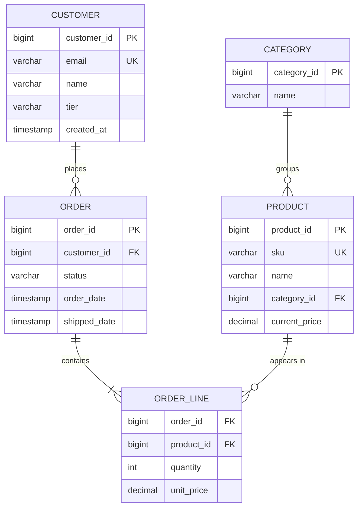
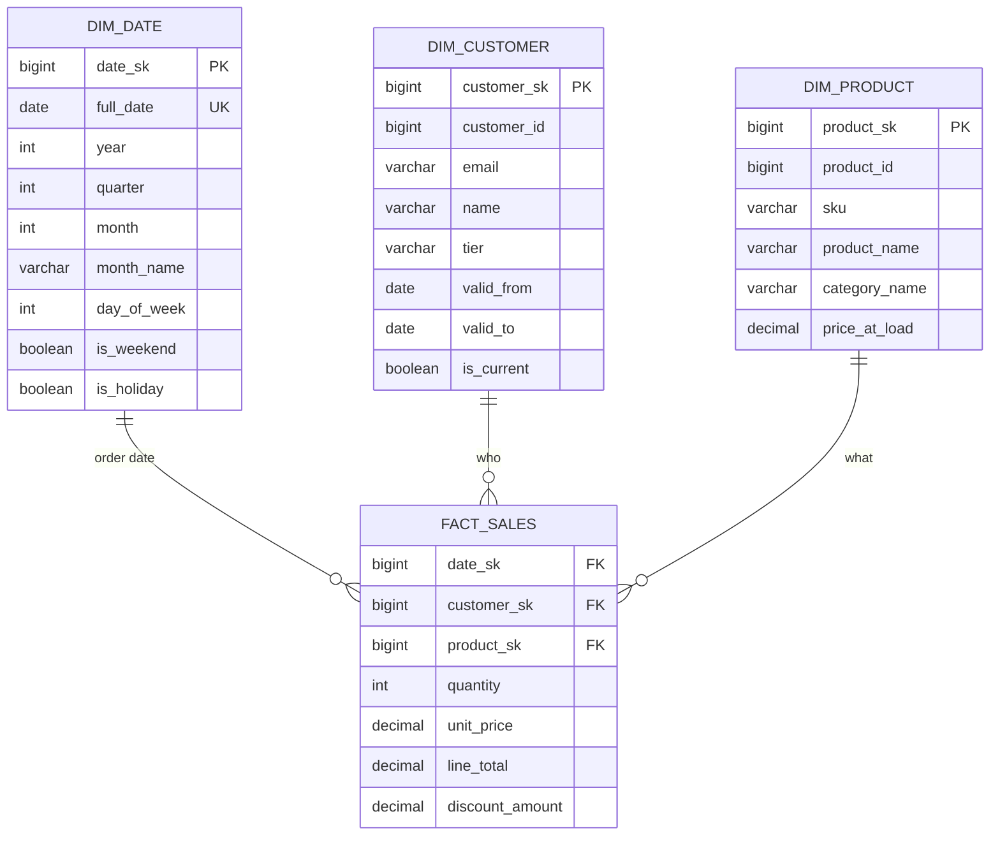

+++
title = 'Enterprise Database Design Patterns'
date = 2026-01-25T12:00:00+05:30
draft = false
tags = ['databases', 'data-modeling', 'oltp', 'reporting', 'star-schema', 'dimensional-modeling']
summary = 'Production-grade patterns for OLTP and reporting systems: transactions, concurrency, dimensional modeling, data pipelines, and schema evolution.'
mermaid = true
+++

***

# Enterprise Database Design Patterns

This document covers **production-grade patterns** for both OLTP and reporting systems. For normalization fundamentals (1NF-5NF), see [Data Modeling & Normalization](/learning/posts/data-modeling-normalization).

## Two Workloads, Two Design Philosophies

Before diving into patterns, understand that **OLTP and Reporting have fundamentally different goals**:

| Aspect           | OLTP (Transactional)                     | Reporting (Analytics)                    |
|------------------|------------------------------------------|------------------------------------------|
| **Primary goal** | Correctness under concurrency            | Fast, consistent queries                 |
| **Schema shape** | Normalized (3NF), narrow tables          | Denormalized (star/snowflake), wide      |
| **Optimized for**| Writes, point lookups, small transactions| Reads, aggregations, large scans         |
| **Indexes**      | Selective, minimal                       | Covering, partition-aligned              |
| **Success metrics**| Latency (p95/p99), throughput, deadlocks| Query time, analyst productivity         |

> **Design principle:** Build OLTP for correctness first, Reporting for usability + speed, and connect them with reliable pipelines.

***

## Domain-First Modeling

Senior engineers avoid "pretty but wrong" schemas by starting from business concepts:

### Key Concepts

| Concept       | Definition                                    | Example                              |
|---------------|-----------------------------------------------|--------------------------------------|
| **Invariant** | Rule that must always hold                    | "Balance ≥ 0 unless overdraft enabled" |
| **Aggregate** | Data that must change atomically              | Order + OrderLines (same transaction)|
| **Entity**    | Has identity + lifecycle                      | Customer, Account, Policy            |
| **Value Object** | No identity, compared by value             | Money, Address, DateRange            |
| **Event**     | Immutable fact for audit + projections        | PaymentReceived, AddressChanged      |

### Relationship Design Guidelines

* Prefer **1:M** relationships for clarity and performance
* Resolve **M:N** with intersection tables (add attributes where needed)
* Enforce cardinality explicitly:
  * `NOT NULL` FKs → mandatory relationship
  * `UNIQUE` constraint → 1:1 relationship

***

## Transactions & Concurrency

This is what separates toy databases from enterprise systems.

### ACID Properties

| Property        | Meaning                                      | Practical Impact                          |
|-----------------|----------------------------------------------|-------------------------------------------|
| **Atomicity**   | All changes commit together or none do       | Failed payment doesn't leave partial state|
| **Consistency** | Constraints/invariants hold at commit        | Balance never goes negative (if enforced) |
| **Isolation**   | Concurrent transactions don't interfere      | Two users buying last item → one succeeds |
| **Durability**  | Committed data survives crashes              | Confirmed order isn't lost on restart     |

### Isolation Levels & Anomalies

| Isolation Level  | Dirty Read | Non-Repeatable Read | Phantom Read | Write Skew |
|------------------|------------|---------------------|--------------|------------|
| Read Uncommitted | ✗ Possible | ✗ Possible          | ✗ Possible   | ✗ Possible |
| Read Committed   | ✓ Prevented| ✗ Possible          | ✗ Possible   | ✗ Possible |
| Repeatable Read  | ✓ Prevented| ✓ Prevented         | ✗ Possible   | ✗ Possible |
| Serializable     | ✓ Prevented| ✓ Prevented         | ✓ Prevented  | ✓ Prevented|

**Anomaly definitions:**

* **Dirty read:** Reading uncommitted changes that may roll back
* **Non-repeatable read:** Same row returns different values within one transaction
* **Phantom read:** New rows appear in a range query during transaction
* **Write skew:** Two transactions each make "safe" decisions that combined violate a rule

### Concurrency Patterns

| Pattern                    | When to Use                        | Implementation                           |
|----------------------------|------------------------------------|------------------------------------------|
| **Atomic update with guard** | Simple state changes             | `UPDATE ... SET stock = stock - 1 WHERE stock >= 1` |
| **Optimistic (OCC)**       | Low contention, retries acceptable | Add `version` column, check on update    |
| **Pessimistic locking**    | High contention, conflicts costly  | `SELECT ... FOR UPDATE`, keep txn short  |
| **Idempotency keys**       | Retries in distributed systems     | Store `idempotency_key` with UNIQUE      |

**OCC Example:**

```sql
-- Read with version
SELECT id, balance, version FROM account WHERE id = 123;
-- Returns: balance=100, version=5

-- Update with version check
UPDATE account
SET balance = 80, version = version + 1
WHERE id = 123 AND version = 5;
-- If 0 rows affected → someone else changed it → retry
```

### Deadlock Prevention

* Lock resources in **consistent order** (e.g., always by ascending ID)
* Keep transactions **short** — no user interaction mid-transaction
* Avoid mixing long reads with writes in same transaction

***

## Keys & Identifiers

### Primary Key Strategy

| Approach         | Pros                              | Cons                               | Use When                          |
|------------------|-----------------------------------|------------------------------------|-----------------------------------|
| **Surrogate PK** | Stable, never changes             | No business meaning                | Default choice for most tables    |
| **Natural PK**   | Business meaning, no extra column | May change, often composite        | Immutable business identifiers    |
| **Composite PK** | No extra column for junctions     | Complex joins, harder to reference | Junction/intersection tables      |

**Best practice:** Use surrogate PKs + keep business keys as `UNIQUE` columns:

```sql
CREATE TABLE customer (
    customer_id   BIGINT PRIMARY KEY,        -- surrogate (stable)
    email         VARCHAR(255) UNIQUE,       -- business key
    external_ref  VARCHAR(100) UNIQUE        -- integration key
);
```

### Identifier Types Comparison

| Type              | Generation        | Index Size | Locality | Best For                      |
|-------------------|-------------------|------------|----------|-------------------------------|
| Sequential INT    | Centralized       | Small      | Excellent| Single-DB OLTP                |
| UUID v4           | Distributed       | Large      | Poor     | Distributed systems           |
| UUID v7 / ULID    | Distributed       | Large      | Good     | Distributed + time-ordering   |
| Snowflake ID      | Distributed       | Medium     | Good     | High-volume distributed       |

### External ID Safety

* **Never** use external IDs as internal PKs (they can change or collide)
* Always maintain a mapping: `internal_id ↔ external_ref`

***

## Time, History & Auditability

### Timestamp Rules

* Store all timestamps in **UTC**
* Distinguish between:
  * **Event time:** when it actually happened
  * **Record time:** when it was stored/processed
  * **Effective date:** when it takes effect (may be future)

### History Patterns Comparison

| Pattern              | Use Case                        | Pros                          | Cons                          |
|----------------------|---------------------------------|-------------------------------|-------------------------------|
| **Audit columns**    | Basic tracking                  | Simple, minimal overhead      | No history, only latest       |
| **Type 2 SCD**       | Track attribute changes         | Full history, point-in-time   | Complex queries, more storage |
| **Event sourcing**   | Complete audit trail            | Immutable, replay-able        | Complex reads, eventual state |
| **Temporal tables**  | System-managed history          | Automatic, SQL standard       | DB-specific support           |

### Audit Columns (Minimum)

```sql
CREATE TABLE order (
    order_id    BIGINT PRIMARY KEY,
    -- business columns...
    created_at  TIMESTAMP NOT NULL DEFAULT CURRENT_TIMESTAMP,
    created_by  VARCHAR(100) NOT NULL,
    updated_at  TIMESTAMP NOT NULL DEFAULT CURRENT_TIMESTAMP,
    updated_by  VARCHAR(100) NOT NULL
);
```

### Type 2 SCD Example

```sql
CREATE TABLE customer_history (
    customer_sk   BIGINT PRIMARY KEY,       -- surrogate for this version
    customer_id   BIGINT NOT NULL,          -- business key
    name          VARCHAR(100),
    tier          VARCHAR(20),
    valid_from    DATE NOT NULL,
    valid_to      DATE,                     -- NULL = current
    is_current    BOOLEAN NOT NULL DEFAULT TRUE
);

-- Find customer state at a specific date
SELECT * FROM customer_history
WHERE customer_id = 123
  AND valid_from <= '2024-06-15'
  AND (valid_to IS NULL OR valid_to > '2024-06-15');
```

***

## OLTP Schema Design

### Table Design Rules

* Keep tables **narrow** — avoid wide "god tables"
* Store **atomic** attributes — avoid JSON blobs unless justified
* Use **explicit status columns** with constrained values
* Model **state transitions** intentionally — document valid transitions

### Constraint Checklist

| Constraint   | Use For                                        | Example                                |
|--------------|------------------------------------------------|----------------------------------------|
| `NOT NULL`   | Required fields                                | `email VARCHAR(255) NOT NULL`          |
| `UNIQUE`     | Business keys, idempotency keys                | `UNIQUE (email)`                       |
| `FOREIGN KEY`| Referential integrity                          | `REFERENCES customer(customer_id)`     |
| `CHECK`      | Domain rules (ranges, enums)                   | `CHECK (amount >= 0)`                  |
| `DEFAULT`    | Sensible defaults, timestamps                  | `DEFAULT CURRENT_TIMESTAMP`            |

### Common OLTP Anti-Patterns

| Anti-Pattern                  | Problem                              | Fix                                  |
|-------------------------------|--------------------------------------|--------------------------------------|
| Lists in columns              | Breaks 1NF, can't query/index        | Child table with FK                  |
| Magic strings for status      | Typos, invalid states                | CHECK constraint or enum table       |
| Over-indexing                 | Slow writes, wasted storage          | Index only what queries need         |
| Read-modify-write without lock| Race conditions, lost updates        | OCC or atomic updates                |
| Wide tables (50+ columns)     | Poor cache utilization               | Split into related tables            |

***

## Dimensional Modeling (Reporting/Analytics)

### Star Schema Fundamentals

```text
                    ┌─────────────┐
                    │  dim_date   │
                    └──────┬──────┘
                           │
┌─────────────┐     ┌──────┴──────┐     ┌─────────────┐
│dim_customer │────▶│ fact_sales  │◀────│ dim_product │
└─────────────┘     └──────┬──────┘     └─────────────┘
                           │
                    ┌──────┴──────┐
                    │ dim_store   │
                    └─────────────┘
```

| Component        | Purpose                               | Characteristics                       |
|------------------|---------------------------------------|---------------------------------------|
| **Fact table**   | Measurements/events at defined grain  | Narrow, many rows, numeric measures   |
| **Dimension**    | Descriptive context for analysis      | Wide, fewer rows, text attributes     |

### Grain: The #1 Design Decision

Define grain as a sentence before designing:

| Grain Statement                        | Fact Table          | Typical Measures                    |
|----------------------------------------|---------------------|-------------------------------------|
| "One row per **order line**"           | fact_order_lines    | quantity, unit_price, line_total    |
| "One row per **transaction**"          | fact_transactions   | amount, fee                         |
| "One row per **account per day**"      | fact_daily_balance  | balance, available_credit           |

**Rule:** Never mix grains in one fact table.

### Fact Types

| Type             | Can Sum Across      | Example                | Handling                           |
|------------------|---------------------|------------------------|------------------------------------|
| **Additive**     | All dimensions      | Sales amount, quantity | Sum freely                         |
| **Semi-additive**| Some dims, not time | Account balance        | Use snapshot facts, avg over time  |
| **Non-additive** | None                | Conversion rate, ratio | Store components, compute in query |

### SCD (Slowly Changing Dimension) Types

| Type   | Behavior                    | Use Case                         | Trade-off                        |
|--------|-----------------------------|----------------------------------|----------------------------------|
| Type 0 | Never changes               | Fixed attributes (birth date)    | No flexibility                   |
| Type 1 | Overwrite                   | Corrections, non-historical      | Loses history                    |
| Type 2 | New row per change          | Track history over time          | Complex, more storage            |
| Type 3 | Previous value in column    | Limited history (1 prior value)  | Only partial history             |

**Type 2 Example:**

```text
customer_sk | customer_id | name    | tier   | valid_from | valid_to   | is_current
------------|-------------|---------|--------|------------|------------|------------
1001        | C123        | Alice   | Bronze | 2023-01-01 | 2024-03-14 | false
1002        | C123        | Alice   | Silver | 2024-03-15 | NULL       | true
```

### Common Patterns

* **Transaction fact + Snapshot fact:** Events vs point-in-time state
* **Bridge tables:** Many-to-many dimensions (customer ↔ segments)
* **Role-playing dimensions:** Same dim, multiple FKs (order_date, ship_date → dim_date)
* **Junk dimensions:** Low-cardinality flags combined into one dim

***

## Data Pipelines (OLTP → Reporting)

### Pipeline Approaches

| Approach       | Latency       | Complexity | Best For                              |
|----------------|---------------|------------|---------------------------------------|
| **Batch ETL**  | Hours/Daily   | Low        | Traditional BI, stable reports        |
| **Batch ELT**  | Hours/Daily   | Medium     | Cloud DW with transformation power    |
| **CDC**        | Minutes       | Medium     | Near-real-time, event-driven          |
| **Streaming**  | Seconds       | High       | Real-time dashboards, alerts          |

### Reliability Patterns

| Pattern              | Purpose                                    | Implementation                          |
|----------------------|--------------------------------------------|-----------------------------------------|
| **Outbox pattern**   | Atomic business write + event publish      | Write to outbox table in same txn       |
| **Idempotent loads** | Safe reruns without duplicates             | Natural keys + MERGE/upsert             |
| **Late-arriving dim**| Handle facts before dimensions exist       | "Unknown" dimension record + backfill   |
| **Reconciliation**   | Prove reporting matches source             | Row counts, sums, balance checks        |

> **Guiding principle:** Reporting is only as good as its lineage, deduplication, and reconciliation.

***

## Indexing Strategy

| Aspect             | OLTP                              | Reporting                              |
|--------------------|-----------------------------------|----------------------------------------|
| **Index for**      | PK lookups, FK joins, uniqueness  | Dimension key joins, partition filters |
| **Index count**    | Minimal (writes matter)           | More liberal (reads dominate)          |
| **Query pattern**  | Point lookups, small ranges       | Large scans, aggregations              |
| **Pre-aggregation**| Rarely                            | Summary tables, materialized views     |

### Query Optimization Tips

* Keep predicates **sargable** — avoid `WHERE YEAR(date_col) = 2024`
* Fetch only needed columns — avoid `SELECT *`
* Use covering indexes for hot queries
* Partition-align filters (time-based queries on time-partitioned tables)

***

## Partitioning & Data Lifecycle

### Partitioning Strategy

| Partition Type  | Best For                          | Example                              |
|-----------------|-----------------------------------|--------------------------------------|
| **Range (time)**| Logs, transactions, events        | Monthly partitions on `created_at`   |
| **List**        | Regional data, tenant isolation   | Partition per `region` or `tenant_id`|
| **Hash**        | Even distribution                 | Hash on `customer_id`                |

**Benefits:** Faster queries (partition pruning), efficient archival/purge, parallel processing.

### Data Lifecycle Tiers

| Tier   | Age           | Storage          | Access Pattern          |
|--------|---------------|------------------|-------------------------|
| Hot    | 0-30 days     | Primary DB/SSD   | Frequent reads/writes   |
| Warm   | 30-365 days   | Secondary/cheaper| Occasional queries      |
| Cold   | 1+ years      | Archive/object   | Rare, compliance only   |

***

## Schema Evolution

### Expand/Contract Pattern (Safe Default)

```text
1. EXPAND    → Add new nullable columns/tables
2. BACKFILL  → Populate in batches
3. DUAL-WRITE→ Keep old + new in sync (if needed)
4. MIGRATE   → Move consumers to new schema
5. CONTRACT  → Drop old columns after confidence window
```

### Safe vs Dangerous Changes

| Safe (Online)                    | Dangerous (Requires Planning)             |
|----------------------------------|-------------------------------------------|
| Add nullable column              | Drop column with data                     |
| Add new table                    | Rename column                             |
| Add index (CONCURRENTLY)         | Change column type                        |
| Add CHECK constraint (NOT VALID) | Add NOT NULL to existing column           |

***

## Security & Data Quality

### Security Checklist

* **Minimize PII** — store only what's necessary
* **Encrypt** — in transit (TLS) and at rest
* **Least privilege** — separate read/write/admin roles
* **Audit trail** — log sensitive data access and changes

### Data Quality Layers

| Layer          | When          | How                                        |
|----------------|---------------|--------------------------------------------|
| Prevention     | At write time | Constraints, validation, reference tables  |
| Detection      | Continuous    | Profiling, anomaly checks, threshold alerts|
| Correction     | On discovery  | Documented fix procedures, backfills       |
| Reconciliation | Periodic      | Source vs derived comparisons              |

***

## Running Example: E-Commerce OLTP → Star Schema

This example shows how the same business concepts map from normalized OLTP to dimensional reporting.

### OLTP Schema (Normalized, 3NF)



**Characteristics:** Normalized, no redundancy, optimized for writes.

### Star Schema (Dimensional, for Reporting)



**Grain:** One row per order line (sale transaction)

**Characteristics:** Denormalized (category_name in dim_product), surrogate keys, SCD Type 2 on customer.

### Transformation Mapping

| OLTP Source                        | Star Schema Target      | Transformation                 |
|------------------------------------|-------------------------|--------------------------------|
| `order.order_date`                 | `fact_sales.date_sk`    | Lookup in dim_date             |
| `customer.*`                       | `dim_customer.*`        | SCD Type 2 (track tier changes)|
| `product.* + category.name`        | `dim_product.*`         | Flatten join, snapshot price   |
| `order_line.quantity * unit_price` | `fact_sales.line_total` | Computed measure               |

### Sample Queries

**OLTP Query (get customer's recent orders):**

```sql
SELECT o.order_id, o.order_date, SUM(ol.quantity * ol.unit_price) as total
FROM order o
JOIN order_line ol ON o.order_id = ol.order_id
WHERE o.customer_id = 123 AND o.order_date > CURRENT_DATE - 30
GROUP BY o.order_id, o.order_date;
```

**Star Schema Query (sales by category and month):**

```sql
SELECT
    d.year, d.month_name,
    p.category_name,
    SUM(f.line_total) as revenue,
    SUM(f.quantity) as units_sold
FROM fact_sales f
JOIN dim_date d ON f.date_sk = d.date_sk
JOIN dim_product p ON f.product_sk = p.product_sk
WHERE d.year = 2024
GROUP BY d.year, d.month_name, p.category_name
ORDER BY d.year, d.month, revenue DESC;
```

***

## Quick Reference Checklists

### OLTP Design Review

* [ ] Invariants identified and enforced (constraints, triggers, app logic)?
* [ ] Concurrency strategy defined (OCC, pessimistic, atomic updates)?
* [ ] Idempotency keys for retry-safe operations?
* [ ] Audit columns on sensitive tables?
* [ ] Indexes aligned with top query patterns?
* [ ] Foreign keys enforcing referential integrity?

### Reporting Design Review

* [ ] Grain stated as a sentence for each fact table?
* [ ] Fact types classified (additive/semi-additive/non-additive)?
* [ ] SCD type chosen for each dimension attribute?
* [ ] Conformed dimensions shared across marts?
* [ ] Late-arriving data strategy defined?
* [ ] Reconciliation checks automated?

***

## Learning Path (Recommended Order)

For fastest enterprise readiness, learn these topics in order:

| Priority | Topic                                | Key Concepts                                    |
|----------|--------------------------------------|-------------------------------------------------|
| 1        | Transactions & Concurrency           | ACID, isolation levels, OCC, idempotency        |
| 2        | Normalization & Constraints          | 1NF-3NF, when to enforce what, anomalies        |
| 3        | Dimensional Modeling                 | Grain, facts, dimensions, SCD types             |
| 4        | Indexing Strategy                    | OLTP vs reporting, covering indexes, sargability|
| 5        | Partitioning & Archival              | Time-based partitions, hot/warm/cold tiers      |
| 6        | Data Pipelines                       | CDC, ETL/ELT, reconciliation, idempotent loads  |
| 7        | Schema Evolution                     | Expand/contract, safe migrations                |
